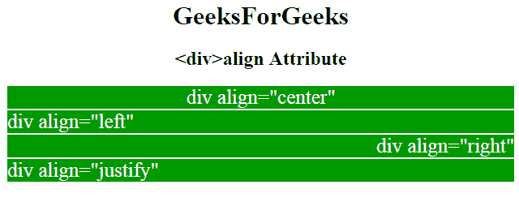

# HTML | div 对齐属性

> 原文:[https://www.geeksforgeeks.org/html-div-align-attribute/](https://www.geeksforgeeks.org/html-div-align-attribute/)

**HTML div align 属性**用于指定 **< div >** 元素或 div 元素内部内容的对齐方式。

**语法:**

```html
<div align="left | right | center | justify";>
```

**属性值:**

*   **Left:** It sets the content to be aligned to the left.
*   **Right:** It sets the content to right alignment.
*   **Center:** I set the div element to the center.
*   **Self-justification:** Set the content to a self-justification position.

**示例:**

```html
<!DOCTYPE html>
<html>

<head>
    <title>gfg</title>
    <style type=text/css>
        p {
            background-color: gray;
            margin: 10px;
        }

        div {
            color: white;
            background-color: 009900;
            margin: 2px;
            font-size: 25px;
        }

        body {
            text-align: center;
        }
    </style>

</head>

<body>
    <h1>GeeksForGeeks</h1>
    <h2><div>align Attribute</h2>
    <div align="center"> 
      div align="center"
  </div>
    <div align="left">
      div align="left" 
  </div>
    <div align="right">
      div align="right" 
  </div>
    <div align="justify">
      div align="justify" 
  </div>

</body>

</html>
```

**输出:**


**支持的浏览器:**HTML div align Attribute 支持的浏览器如下所列:

*   谷歌 Chrome
*   微软公司出品的 web 浏览器
*   火狐浏览器

 [HTML 教程](https://www.geeksforgeeks.org/html-tutorials/)

 [HTML 示例](https://www.geeksforgeeks.org/html-examples/)