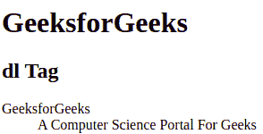

# HTML dl 标记

> 哎哎哎:# t0]https://www . geeksforgeeks . org/html-dl 标签/

HTML 中的

标签用来表示描述列表。此标签与 [< dt >](https://www.geeksforgeeks.org/html-dt-tag/) 和 [< dd >标签](https://www.geeksforgeeks.org/html-dd-tag/)一起使用。在 HTML4.1 中定义定义列表，在 HTML5 中定义描述列表。

**语法:**

```html
<dl> Contents... </dl>
```

**示例:**

## 超文本标记语言

```html
<!DOCTYPE html>

<html>

    <body>

        <h1>GeeksforGeeks</h1>
        <h2>dl Tag</h2>
        <!-- HTML dl tag -->
        <dl>
            <dt>GeeksforGeeks</dt>
            <dd>A Computer Science Portal For Geeks</dd>
        </dl>

    </body>

</html>                   
```

**输出:**



**支持的浏览器:**

*   谷歌 Chrome
*   微软公司出品的 web 浏览器
*   火狐浏览器
*   旅行队
*   歌剧