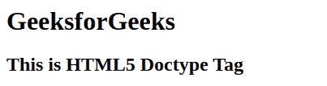

# HTML Doctypes

> 原文:[https://www.geeksforgeeks.org/html-doctypes/](https://www.geeksforgeeks.org/html-doctypes/)

**Doctype:**Doctype 或文档类型声明是一个指令，它告诉 web 浏览器当前页面所用的标记语言。Doctype 不是一个元素或标签，它让浏览器知道文档中使用的 HTML 或任何其他标记语言的版本或标准。

**Doctype 的声明**:Doctype 声明出现在网页的顶部，在所有其他元素之前。根据 HTML 规范或标准，每个 HTML 文档都需要文档类型声明，以确保页面按照预期的方式显示。

HTML5 的 DOCTYPE 不区分大小写，可以写成如下所示:

```html
< !DOCTYPE html >
```

**Doctype 用法**:在 HTML 4.01 版本中，Doctype 声明的用法是创建对文档类型定义(DTD)的引用，因为 HTML 4.01 版本完全基于标准通用标记语言(SGML)。
文档类型定义(DTD)负责为标准通用标记语言(SGML)指定规则，以便浏览器正确处理内容。但是在 HTML 版本中，HTML 5 不需要引用文档类型定义(DTD)，因为 HTML 5 不是基于标准通用标记语言(SGML)。

在 HTML 5 中，只有在启用标准模式来编写文档时，才需要 DOCTYPE 声明。
下面是一个带有 doctype 声明的 HTML 示例程序:

**示例:**

## 超文本标记语言

```html
<!DOCTYPE html>
<html>

<body>
    <h1>GeeksforGeeks</h1>
    <h2>This is HTML5 Doctype Tag</h2>
</body>

</html>
```

**输出:**



以下是针对不同版本的 HTML 和 XHTML 的一些常见文档类型声明的列表:

1.  **HTML 5**

    ## 超文本标记语言

    ```html
    <!DOCTYPE html>
    ```

2.  **HTML 4.01 Strict:** 在 HTML 4.01 Strict 文档类型定义(DTD)中，包含了所有那些没有出现在框架集文档中或者没有被弃用的元素和属性。

    ## 超文本标记语言

    ```html
    <!DOCTYPE HTML PUBLIC "-//W3C//DTD HTML 4.01//EN"
       "http://www.w3.org/TR/html4/strict.dtd">
    ```

3.  **HTML 4.01 Transitional:** 在 HTML 4.01 中，Transitional 文档类型定义(DTD)允许一些已经被弃用的较旧的 PUBLIC 和属性。

    ## 超文本标记语言

    ```html
    <!DOCTYPE HTML PUBLIC "-//W3C//DTD HTML 4.01 Transitional//EN"
       "http://www.w3.org/TR/html4/loose.dtd">
    ```

4.  **HTML 4.01 框架集:**在 HTML 4.01 框架集文档类型定义(DTD)中，可以使用框架。

    ## 超文本标记语言

    ```html
    <!DOCTYPE HTML PUBLIC "-//W3C//DTD HTML 4.01 Frameset//EN"
       "http://www.w3.org/TR/html4/frameset.dtd">
    ```

5.  **XHTML 1.0 Strict:** 在 XHTML 1.0 Strict 文档类型定义(DTD)中，不支持不推荐使用的标签，代码必须按照 XML Specification 编写。

    ## 超文本标记语言

    ```html
    <!DOCTYPE html PUBLIC "-//W3C//DTD XHTML 1.0 Strict//EN" 
    "http://www.w3.org/TR/xhtml1/DTD/xhtml1-strict.dtd">
    ```

6.  **XHTML 1.0 Transitional:** 在 XHTML 1.0 Transitional 文档类型定义(DTD)中，允许不推荐使用的元素。

    ## 超文本标记语言

    ```html
    <!DOCTYPE html PUBLIC "-//W3C//DTD XHTML 1.0 Transitional//EN" 
    "http://www.w3.org/TR/xhtml1/DTD/xhtml1-transitional.dtd">
    ```

7.  **XHTML 1.0 框架集:**在 XHTML 1.0 框架集文档类型定义(DTD)中，可以使用框架集。

    ## 超文本标记语言

    ```html
    <!DOCTYPE html PUBLIC "-//W3C//DTD XHTML 1.0 Frameset//EN" 
    "http://www.w3.org/TR/xhtml1/DTD/xhtml1-frameset.dtd">
    ```

8.  **XHTML 1.1:** 在 XHTML 1.1 文档类型定义(DTD)中，允许添加模块。

    ## 超文本标记语言

    ```html
    <!DOCTYPE html PUBLIC "-//W3C//DTD XHTML 1.1//EN" 
    "http://www.w3.org/TR/xhtml11/DTD/xhtml11.dtd">
    ```

**支持的浏览器:**

*   谷歌 Chrome
*   微软公司出品的 web 浏览器
*   火狐浏览器
*   歌剧
*   旅行队