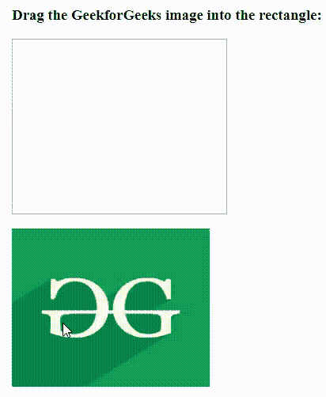
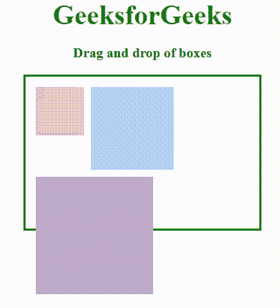
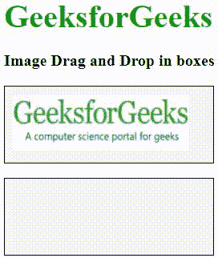
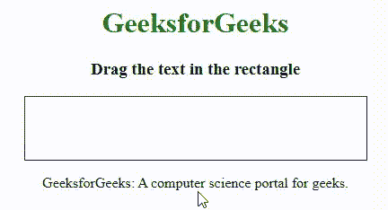

# HTML 拖放

> 原文:[https://www.geeksforgeeks.org/html-drag-and-drop/](https://www.geeksforgeeks.org/html-drag-and-drop/)

**示例:**此示例显示了 HTML 中图像的拖放&。

## 超文本标记语言

```html
<!DOCTYPE HTML>
<html>
<head>
    <style>
    #getData {
        width: 250px;
        height: 200px;
        padding: 10px;
        border: 1px solid #4f4d4d;
    }
    </style>
    <script>
    function allowDrop(even) {
        even.preventDefault();
    }

    function drag(even) {
        even.dataTransfer.setData("text", even.target.id);
    }

    function drop(even) {
        even.preventDefault();
        var fetchData = even.dataTransfer.getData("text");
        even.target.appendChild(document.getElementById(fetchData));
    }
    </script>
</head>

<body>
    <h3>Drag the GeekforGeeks image into the rectangle:</h3>
    <div id="getData" 
         ondrop="drop(event)" 
         ondragover="allowDrop(event)">
      </div>
    <br> 
     
</body>
</html>
```

**输出:**



拖放是一个非常交互式和用户友好的概念，通过抓取它可以更容易地将对象移动到不同的位置。这允许用户在一个元素上单击并按住鼠标按钮，将其拖动到另一个位置，然后释放鼠标按钮将该元素放在那里。在 HTML 5 中，拖放更容易编码，并且其中的任何元素都是可拖动的。
**拖放事件:**有各种拖放事件，下面列出了其中一些:

*   [**【ondrag:**](https://www.geeksforgeeks.org/html-ondrag-event-attribute/)**用于在 HTML 中拖动元素或文本选择时使用。**
*   **[**【ondragstart】**](https://www.geeksforgeeks.org/html-ondragstart-event-attribute/):用于调用一个函数，drag(事件)，指定要拖动什么数据。**
*   **[**【on dragenter】**](https://www.geeksforgeeks.org/html-ondragenter-event-attribute/):用于判断投放目标是否为接受投放。如果放弃被接受，那么这个事件必须被取消。**
*   **[**【on dragon leave】**](https://www.geeksforgeeks.org/html-ondragleave-event-attribute/):拖动时鼠标离开有效放置目标前的元素时出现。**
*   **[](https://www.geeksforgeeks.org/html-ondragover-event-attribute/)**:指定拖动的数据可以放在哪里。****
*   ****[**【on drop】**](https://www.geeksforgeeks.org/html-ondrop-event-attribute/):指定拖动操作结束时下落发生的位置。****
*   ****[**ondragend**](https://www.geeksforgeeks.org/html-ondragend-event-attribute/) :当用户拖动完一个元素时出现。****

******数据传输对象:**当整个拖放过程发生时，使用数据传输属性。它用于保存从源拖动的数据，并将其放到所需的位置。以下是与之相关的属性:****

*   ******dataTransfer.setData(格式，数据)**:用于设置要拖动的数据。****
*   ******dataTransfer.clearData(格式):**用于调用此函数，没有清除所有数据的参数。用格式参数调用它只会移除特定的数据。****
*   ******dataTransfer.getData(格式):**返回指定格式的数据。如果没有这样的数据，则返回空字符串。****
*   ******数据传输类型:**该属性返回 dragstart 事件中设置的所有格式的数组。****
*   ******dataTransfer.files** :用于返回所有要删除的文件。****
*   ******dataTransfer.setDragImage(元素，x，y):** 用于将现有图像显示为拖动图像，而不是光标旁边的默认图像。坐标指定放置位置。****
*   ******dataTransfer.addElement(元素):**用于添加指定的要绘制为拖动反馈图像的元素。****
*   ******dataTransfer.effectAllowed(值):**它将告诉浏览器只允许用户进行列出的操作类型。该属性可以设置为以下值:无、复制、复制链接、复制移动、链接、链接移动、移动、全部和未初始化。****
*   ******dataTransfer.dropEffect(值):**用于控制用户在拖动输入和拖动事件中给出的反馈。当用户将鼠标悬停在目标元素上时，浏览器的光标将指示将要发生什么类型的操作(例如，复制、移动等)。).该效果可以采用以下值之一:无、复制、链接、移动。****

******拖放程序:******

*   ******步骤 1:** 使对象可拖动

    *   首先将该元素的可拖动属性设置为真
    *   然后，指定拖动元素时应该发生什么。 *ondragstart* 属性调用一个函数 drag(事件)，指定要拖动哪些数据。方法设置被拖动数据的数据类型和值
    *   事件监听器 *ondragstart* 将设置允许的效果(复制、移动、链接或某种组合)。**** 
*   ******第二步:**放下物体

    *   *ondragover* 事件指定拖动的数据可以放在哪里。默认情况下，数据/元素不能放在其他元素中。要允许删除，它必须防止元素的默认处理。这是通过调用 event.preventDefault()方法来完成的
    *   最后是 drop 事件，它允许执行实际的 drop**** 

******示例 1:** 该示例说明了元素的*可拖动*属性的使用。****

## ****超文本标记语言****

```html
**<!DOCTYPE HTML>
<html>

<head>
    <title>Drag and Drop box</title>
    <script>
    function allowDrop(ev) {
        ev.preventDefault();
    }

    function dragStart(ev) {
        ev.dataTransfer.setData("text", ev.target.id);
    }

    function dragDrop(ev) {
        ev.preventDefault();
        var data = ev.dataTransfer.getData("text");
        ev.target.appendChild(document.getElementById(data));
    }
    </script>
    <style>
    #box {
        margin: auto;
        width: 50%;
        height: 200px;
        border: 3px solid green;
        padding: 10px;
    }

    #box1,
    #box2,
    #box3 {
        float: left;
        margin: 5px;
        padding: 10px;
    }

    #box1 {
        width: 50px;
        height: 50px;
        background-color: #F5B5C5;
    }

    #box2 {
        width: 100px;
        height: 100px;
        background-color: #B5D5F5;
    }

    #box3 {
        width: 150px;
        height: 150px;
        background-color: #BEA7CC;
    }

    p {
        font-size: 20px;
        font-weight: bold;
        text-align: center;
    }

    .gfg {
        font-size: 40px;
        color: #009900;
        font-weight: bold;
        text-align: center;
    }
    </style>
</head>

<body>
    <div class="gfg">GeeksforGeeks</div>
    <p>Drag and drop of boxes</p>

    <div id="box">
        <div id="box1" draggable="true"
             ondragstart="dragStart(event)">
        </div>
        <div id="box2" draggable="true"
             ondragstart="dragStart(event)">
        </div>
        <div id="box3" ondrop="dragDrop(event)" 
             ondragover="allowDrop(event)">
        </div>
    </div>
</body>

</html>**
```

******说明:******

*   ****通过将要拖动的元素的可拖动属性设置为 true 来开始拖动。****
*   ****用 *dataTransfer.getData()* 方法获取拖动的数据。此方法将返回在*设置数据()*方法中设置为相同类型的任何数据。****
*   ****调用***event . preventdefault()***方法，通过阻止元素的默认处理来允许删除其他元素中的元素。****
*   ****该元素存储在我们附加到 drop 元素中的变量数据中。****

******输出:******

********

******示例 2:** 此示例说明了图像拖放。****

## ****超文本标记语言****

```html
**<!DOCTYPE HTML>
<html>
<head>
    <script>
    function allowDrop(ev) {
        ev.preventDefault();
    }

    function dragStart(ev) {
        ev.dataTransfer.setData("text", ev.target.id);
    }

    function dragDrop(ev) {
        ev.preventDefault();
        var data = ev.dataTransfer.getData("text");
        ev.target.appendChild(document.getElementById(data));
    }
    </script>
    <style>
    .div1 {
        width: 240px;
        height: 75px;
        padding: 10px;
        border: 1px solid black;
        background-color: #F5F5F5;
    }

    p {
        font-size: 20px;
        font-weight: bold;
    }

    .gfg {
        font-size: 40px;
        color: #009900;
        font-weight: bold;
    }
    </style>
</head>

<body>
    <div class="gfg">GeeksforGeeks</div>
    <p>Image Drag and Drop in boxes</p>

    <div class="div1" 
         ondrop="dragDrop(event)" 
         ondragover="allowDrop(event)"> 
     
       </div>
    <br>
    <div class="div1" 
         ondrop="dragDrop(event)" 
         ondragover="allowDrop(event)">
    </div>
</body>
</html>**
```

******输出:******

********

******示例 3:** 本示例演示了在 HTML 中拖动矩形框中的文本。****

## ****超文本标记语言****

```html
**<!DOCTYPE HTML>
<html>
<head>
    <title>Draggable Text</title>
    <style>
    .dropbox {
        width: 350px;
        height: 40px;
        padding: 15px;
        border: 1px solid #292828;
    }

    h1 {
        color: green;
    }
    </style>
    <script>
    function droppoint(event) {
        var data = event.dataTransfer.getData("Text");
        event.target.appendChild(document.getElementById(data));
        event.preventDefault();
    }

    function allowDropOption(event) {
        event.preventDefault();
    }

    function dragpoint(event) {
        event.dataTransfer.setData("Text", event.target.id);
    }
    </script>
</head>

<body>
    <center>
        <h1>GeeksforGeeks</h1>
        <h3>Drag the text in the rectangle</h3>
        <div class="dropbox" 
             ondrop="droppoint(event)" 
             ondragover="allowDropOption(event)">
          </div>
        <p id="drag1" 
           draggable="true" 
           ondragstart="dragpoint(event)"> 
       GeeksforGeeks: A computer science portal for geeks.
          </p>

    </center>
</body>
</html>**
```

******输出:******

********

******支持的浏览器:******

*   ****谷歌 Chrome 93.0****
*   ****微软边缘 93.0****
*   ****Firefox 92.0****
*   ****Opera 78.0****
*   ****Safari 14.1****