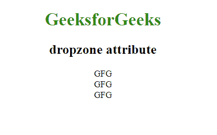

# HTML | dropzone 属性

> 原文:[https://www.geeksforgeeks.org/html-dropzone-attribute/](https://www.geeksforgeeks.org/html-dropzone-attribute/)

HTML 中的 dropzone 属性用于指定当拖动的数据放在任何元素上时是复制、移动还是链接。这个属性在 HTML5 中是新的。

**语法:**

```html
<element dropzone = "move | link | copy">
```

**属性值:**

*   **移动:**此属性用于将数据拖放到新位置。
*   **复制:**该属性用于将拖动数据复制到新位置。
*   **链接:**该属性用于将结果数据拖放到原始数据中。

**示例:**

```html
<!DOCTYPE html> 
<html>
   <head>
      <title>ruby tag</title>
      <style> 
         body { 
             text-align:center; 
         } 
         h1 { 
             color:green; 
         } 
      </style>
   </head>
   <body>
      <h1>GeeksforGeeks</h1>
      <h2> dropzone attribute</h2>
      <div dropzone="copy">GFG</div>
      <div dropzone="move">GFG</div>
      <div dropzone="link">GFG</div>
   </body>
</html>
```

**输出:**


**注意:**drop zone 属性不受流行浏览器的支持。