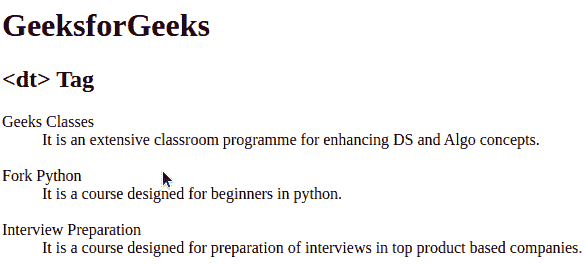

# HTML dt 标记

> 原文:[https://www.geeksforgeeks.org/html-dt-tag/](https://www.geeksforgeeks.org/html-dt-tag/)

HTML 中的

标签用于指定描述列表。在

元件内部使用。它通常后跟一个[T5】DD>标签](https://www.geeksforgeeks.org/html-dd-tag/)。随后的< dd >元素提供了与使用< dt >指定的术语相关联的一些相关文本。

**语法:**

```html
<dt> Content... </dt>
```

**例:**

## 超文本标记语言

```html
<!DOCTYPE html>

<html>

    <body>

        <h1>GeeksforGeeks</h1>
        <h2><dt> Tag</h2>
        <dl>
            <!-- HTML dt tag -->
            <dt>Geeks Classes</dt>
            <dd>It is an extensive classroom programme for
            enhancing DS and Algo concepts.</dd><br>

            <!-- HTML dt tag -->
            <dt>Fork Python</dt>
            <dd>It is a course designed for beginners in
            python.</dd><br>

            <!-- HTML dt tag -->
            <dt>Interview Preparation</dt>
            <dd>It is a course designed for preparation of
            interviews in top product based companies.</dd>
        </dl>

    </body>

</html>                   
```

**输出:**



**支持的浏览器:**

*   谷歌 Chrome
*   微软公司出品的 web 浏览器
*   火狐浏览器
*   歌剧
*   旅行队