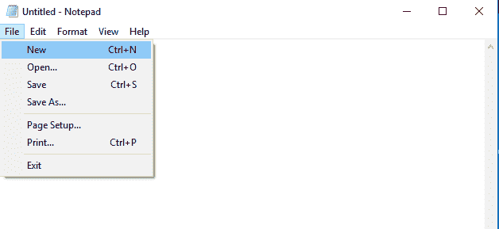
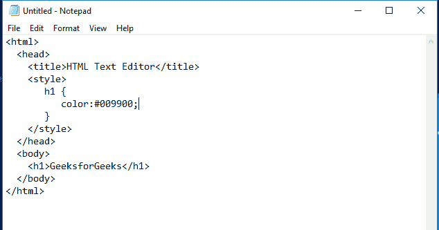
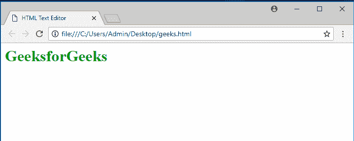

# HTML |编辑器

> 原文:[https://www.geeksforgeeks.org/html-editors/](https://www.geeksforgeeks.org/html-editors/)

HTML 文本编辑器用于创建和修改网页。HTML 代码可以在任何文本编辑器中编写，包括**记事本**。人们只需要在任何文本编辑器中编写 HTML，并以扩展名保存文件”。html”。下面给出了一些流行的 HTML 文本编辑器:

*   笔记本
*   记事本++
*   崇高的文本 3
*   原子
*   geeks forgeeks ide(geeks forgeeks ide)

**记事本:**记事本是一个简单的文本编辑器。它是一个内置的桌面应用程序，在视窗操作系统中可用。
T3】

**括号:**括号是一个开源软件，主要用于 Web 开发。它提供了实时的 HTML、CSS、JavaScript 编辑功能。
T3】

**威震文字 3:** 威震是一款跨平台的代码编辑器工具。它支持所有标记语言。
T3】

**Atom:** Atom 是一款面向 MAC、Linux 和 Windows 的开源代码编辑器工具。
T3】

**在编辑器中编写 HTML 代码的步骤:**

1.  打开您选择的任何文本编辑器。这里我们使用的是**记事本**文本编辑器。
    T3】
2.  新建文件:文件->新建文件或 Ctrl+n
    
3.  在文本编辑器中编写 HTML 代码。
    
4.  用您选择的合适名称和**保存文件。html** 扩展。
    T3】
5.  在您最喜欢的浏览器中打开保存的 HTML 文件(双击文件，或右键单击并选择“打开方式”)。
    

**[GeeksforGeeks IDE](https://ide.geeksforgeeks.org/tryit.php):**它是一个测试代码的在线代码编辑器。它提供了与他人共享代码的可共享链接。

```html
<html>
  <head>
    <title>HTML Text Editor</title>
    <style>
       h1 {
          color:#009900;
       }
    </style>
  </head>
  <body>
    <h1>GeeksforGeeks</h1>
  </body>
</html>
```