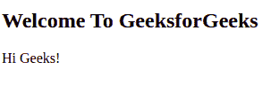
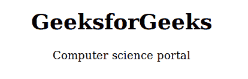
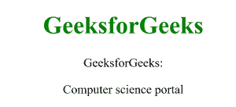
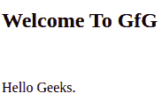

# HTML 元素

> 原文:[https://www.geeksforgeeks.org/html-elements/](https://www.geeksforgeeks.org/html-elements/)

**例:**在本例中< p >是起始标记，< /p >是结束标记，它们之间包含一些内容。开始标记、一些内容和结束标记的组合是一个元素。所以，< p >嗨极客们！< /p >是元素。同样< h2 >欢迎来到极客论坛< /h2 >是另一个元素。

## 超文本标记语言

```html
<!DOCTYPE html>
<html>

<body>
  <h2>Welcome To GeeksforGeeks</h2>
  <p>Hi Geeks!</p>

</body>

</html>
```

**输出:**



HTML 元素是开始和结束标记的集合，内容插入在它们之间。

**支持的标签:** HTML 元素支持几乎所有的 HTML 标签。

**语法:**

```html
<tagname > Contents... </tagname>
```

**示例:**

## 超文本标记语言

```html
<!-- HTML code to illustrate HTML elements -->
<!DOCTYPE html>
<html>

<head>
  <title>HTML Elements</title>
</head>

<body>
  <p>Welcome to GeeksforGeeks!</p>

</body>

</html>
```

**输出:**

```html
Welcome to GeeksforGeeks!
```

**嵌套的 HTML 元素:**在另一个 HTML 元素内部使用的 HTML 元素称为嵌套的 HTML 元素。
T3】例:

## 超文本标记语言

```html
<!DOCTYPE html>
<html>

<head>
  <title>HTML Elements</title>
</head>

<body style="text-align: center">
  <h1>GeeksforGeeks</h1>
  <p>Computer science portal</p>

</body>

</html>
```

**输出:**在本例中，< html >标签包含<头>和<体>。<头>和<体>标签包含另一个元素，因此称为嵌套元素。



**需要添加结束标签:**需要添加元素的结束标签。否则，显示的内容可能正确显示，也可能不正确显示。
T3】例:

## 超文本标记语言

```html
<!DOCTYPE html>
<html>

<head>
    <title>HTML Elements</title>
</head>

<body>
    <!-- h1 tag does not contains
         end tag -->
    <h1>GeeksforGeeks</h1>
    <!-- p tag does not contains
         end tag -->
    <p>Computer science portal</p>

</body>

</html>
```

**例:**



**空 HTML 元素:**没有任何内容即不打印任何内容的 HTML 元素称为空元素。空的 HTML 元素没有结束标记。

对于 Ex。
、

* * *

、<link>、<input>等都是 HTML 元素

**示例:**

## 超文本标记语言

```html
<!DOCTYPE html>
<html>

<head>
  <title>Empty HTML Elements</title>
</head>

<body>
  <h2>Welcome To GfG</h2>
  <br />
  <p>Hello Geeks.</p>

</body>

</html>
```

**输出:**在本例中< br >标签不打印任何内容。它用作断开< h2 >和< p >标记之间的线的特征线。

