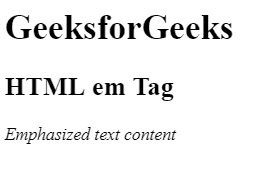

# HTML | em 标签

> 哎哎哎:# t0]https://www . geeksforgeeks . org/html-em-tag/

HTML 中的*标签是短语标签，用于强调文本内容。*

**注意:**使用 CSS 属性可以达到这个效果。

**语法:**

```html
<em> Contents... </em>
```

**示例:**

```html
<!DOCTYPE html>
<html>

<head>
    <title>
        HTML em Tag
    </title>
</head>

<body>
    <h1>GeeksforGeeks</h1>

    <h2>HTML em Tag</h2>

    <em>Emphasized text content</em>
</body>

</html>                    
```

**输出:**


**支持的浏览器:**HTML<em>标签支持的浏览器如下:

*   谷歌 Chrome
*   微软公司出品的 web 浏览器
*   火狐浏览器
*   旅行队
*   歌剧