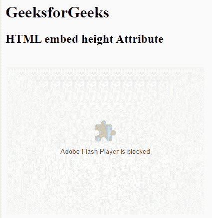

# HTML | embed 身高属性

> 原文:[https://www.geeksforgeeks.org/html-embed-height-attribute/](https://www.geeksforgeeks.org/html-embed-height-attribute/)

**HTML <嵌入>高度属性**用于指定嵌入内容的高度。

**语法:**

```html
<embed height = "pixels">
```

**属性值:**

*   **像素:**宽度值以像素为单位设置。它用于指定嵌入内容的高度。

**示例:**

```html
<!DOCTYPE html> 
<html> 

<head> 
    <title>
        HTML embed height Attribute
    </title> 

    <style> 
        q { 
            color: #00cc00; 
            font-style: italic; 
        } 
    </style> 
</head> 

<body> 
    <h1>GeeksforGeeks</h1> 

    <h2>HTML embed height Attribute</h2>

    <embed src="loading2.swf" width = "400px"
            height="300px"
            type="application/x-shockwave-flash"> 
</body> 

</html>
```

**输出:**


**支持的浏览器:****HTML 嵌入高度属性**支持的浏览器如下:

*   谷歌 Chrome
*   微软公司出品的 web 浏览器
*   火狐浏览器
*   旅行队
*   歌剧