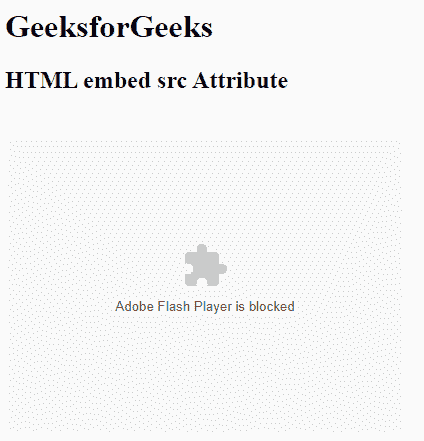

# HTML | embed src 属性

> 原文:[https://www.geeksforgeeks.org/html-embed-src-attribute/](https://www.geeksforgeeks.org/html-embed-src-attribute/)

**HTML <嵌入> src 属性**用于指定嵌入内容的网址。

**语法:**

```html
<embed src="URL">
```

**属性值:**

*   **src:** 用于保存网址。它用于指定嵌入内容的网址。
    1.  **绝对网址:**指向另一个网页。
    2.  **一个相对 URL:** 它指向网站内的一个文件。

**示例:**

```html
<!DOCTYPE html>
<html>

<head>
    <title>HTML embed src Attribute</title>
    <style>
        q {
            color: #00cc00;
            font-style: italic;
        }
    </style>
</head>

<body>
    <h1>GeeksforGeeks</h1>
    <h2>HTML embed src Attribute</h2>
    <br>
    <embed src="loading2.swf" 
           width="400px" 
           height="300px"
           type="application/x-shockwave-flash">
</body>

</html>
```

**输出:**


**支持的浏览器:****HTML 嵌入 src 属性**支持的浏览器如下:

*   谷歌 Chrome
*   微软公司出品的 web 浏览器
*   火狐浏览器
*   苹果 Safari
*   歌剧