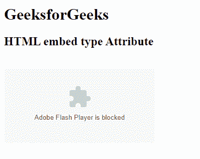

# HTML | embed 类型属性

> 原文:[https://www.geeksforgeeks.org/html-embed-type-attribute/](https://www.geeksforgeeks.org/html-embed-type-attribute/)

**HTML 嵌入类型属性**包含媒体类型内容。它用于指定嵌入内容的媒体类型。

**语法:**

```html
<embed type="media_type">
```

**属性值:**

*   **media_type:** 包含 media_type 内容。它用于指定嵌入内容的媒体类型。

**示例:**

```html
<!DOCTYPE html>
<html>

<head>
    <title>HTML embed type Attribute</title>
    <style>
        q {
            color: #00cc00;
            font-style: italic;
        }
    </style>
</head>

<body>
    <h1>GeeksforGeeks</h1>
    <h2>HTML embed type Attribute</h2>
    <br>
    <embed src="loading2.swf" 
           type="application/x-shockwave-flash">
</body>

</html>
```

**输出**


**支持的浏览器:****HTML 嵌入类型属性**支持的浏览器如下:

*   谷歌 Chrome
*   微软公司出品的 web 浏览器
*   火狐浏览器
*   歌剧