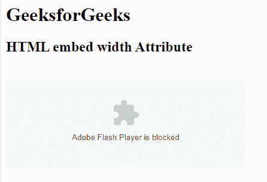

# HTML | embed 宽度属性

> 原文:[https://www.geeksforgeeks.org/html-embed-width-attribute/](https://www.geeksforgeeks.org/html-embed-width-attribute/)

**HTML 嵌入宽度属性**用于指定嵌入内容的宽度。

**语法:**

```html
<embed width="pixels">
```

**属性值:**

*   **像素:**嵌入值的宽度以像素为单位设置。它用于指定嵌入内容的宽度。

**示例:**

```html
<!DOCTYPE html> 
<html> 

<head> 
    <title>HTML embed width Attribute</title> 

    <style> 
        q { 
            color: #00cc00; 
            font-style: italic; 
        } 
    </style> 
</head> 

<body> 
    <h1>GeeksforGeeks</h1> 

    <h2>HTML embed width Attribute</h2>

    <embed src="loading2.swf" width = "400px"
           type="application/x-shockwave-flash"> 
</body> 

</html>
```

**输出:**


**支持的浏览器:****HTML 嵌入宽度属性**支持的浏览器如下:

*   谷歌 Chrome
*   微软公司出品的 web 浏览器
*   火狐浏览器
*   旅行队
*   歌剧