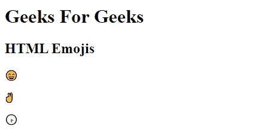

# HTML Emojis

> 原文:[https://www.geeksforgeeks.org/html-emojis/](https://www.geeksforgeeks.org/html-emojis/)

表情符号是来自 UTF-8 (Unicode)字符集的字母(字符)。HTML 中的元素定义了字符集。许多 UTF-8 字符不能在键盘上键入，但它们总是可以用数字(称为实体数字)显示。为了让浏览器理解您正在显示一个字符，您必须以开始实体编号，以；(分号)。

**语法:**

```html
<head>
    <meta charset="UTF-8">                       
</head>

<body>
    <p>&#number;</p>

    // Take 'number' corresponding
    // to UTF-8 characters you want
    // to display.
</body>

```

表情符号也是来自 UTF-8 字母表的字符，可以在 HTML 中使用，方法是在上面的语法中提到相应的表情符号、十进制(dec)或十六进制(hex)引用。

**示例:**表示网页中的以下表情符号。

## 超文本标记语言

```
<!DOCTYPE html>
<html>
<head>
    <meta charset="UTF-8">
</head>

<body>
    <h1>Geeks For Geeks</h1>
    <h2>HTML Emojis </h2>
    <p>😄</p>
    <p>✌</p>
    <p>🕞</p>
</body>
</html>
```

**输出:**


在上面的例子中，以下表情符号使用的十进制引用如下

| 茶 | 十进制参考 | 十六进制引用 |
| --- | --- | --- |
| 😄 | One hundred and twenty-eight thousand five hundred and sixteen | 1F604 |
| □对 | Nine thousand nine hundred and ninety-six | 270 摄氏度 |
| 🕞 | One hundred and twenty-eight thousand three hundred and fifty | 1F55E |

**注意:**代替十进制(dec)引用，也可以使用十六进制(hex)引用在网页中显示表情符号。除了上述语法之外，还需要在十六进制引用之前包含“x”。

**语法:**

```html
<p>&#xhexaDecimal;</p>

```

**示例:**在本例中，我们将表示😄，✌和🕞网页中带有十六进制(十六进制)引用的表情符号。

## 超文本标记语言

```
<!DOCTYPE html>
<html>

<head>
    <meta charset="UTF-8">
</head>

<body>
    <h1>Geeks For Geeks</h1>
    <h2>HTML Emojis</h2>
    <p>😄</p>
    <p>✌</p>
    <p>🕞</p>
</body>

</html>
```

**输出:**


使用十六进制参考，我们也得到相同的输出。

**注意:**因为表情符号是字符，所以它们可以像 HTML 中的任何其他字符一样被复制、显示和调整大小。

**示例:**在本例中，我们将更改以下表情符号的字体大小😄，✌和🕞。

## 超文本标记语言

```
<!DOCTYPE html>
<html>

<head>
    <meta charset="UTF-8">
</head>

<body>
    <h1>Geeks For Geeks</h1>
    <h2>HTML Emojis with different font size </h2>
    <p style="font-size:25px">😄 </p>
    <p style="font-size:65px">✌</p>
    <p style="font-size:75px">🕞</p>
</body>

</html>
```

**输出:**输出包含不同大小的表情符号。


同样，通过在代码中输入相应的十进制或十六进制引用，任何表情符号都可以在网页中显示。