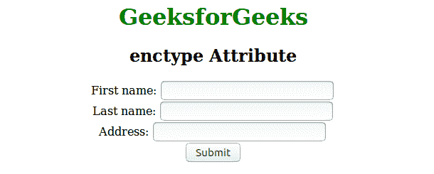

# HTML | enctype 属性

> 原文:[https://www.geeksforgeeks.org/html-enctype-attribute/](https://www.geeksforgeeks.org/html-enctype-attribute/)

此属性指定数据将以提交给服务器时应编码的形式出现。只有当 method = "POST "时，才能使用这种类型的属性。
**语法:**

```html
<form enctype = "value">
```

**元素:**enctype 属性仅与 [<表单> enctype](https://www.geeksforgeeks.org/html-form-enctype-attribute/?ref=rp) 元素关联。
**属性值:**该属性包含以下三个值:

*   **application/x-www-form-URL encoded:**为默认值。它在发送到服务器之前对所有字符进行编码。它将空格转换成+符号，将特殊字符转换成十六进制值。
*   **多部分/表单数据:**该值不编码任何字符。
*   **文本/普通:**该值将空格转换为+符号，但不转换特殊字符。

**例:**

## 超文本标记语言

```html
<!DOCTYPE html>
<html>
    <head>
        <title>enctype attribute</title>
        <style>
            h1 {
                color:green;
            }
            body {
                text-align:center;
            }
        </style>
    </head>
    <body>

        <h1>GeeksforGeeks</h1>
        <h2>enctype Attribute</h2>
        <form action="#" method="post"
                        enctype="multipart/form-data">

            First name: <input type="text" name="fname"><br>
            Last name: <input type="text" name="lname"><br>
            Address: <input type="text" name="Address"><br>

            <input type="submit" value="Submit">
        </form>

    </body>
</html>                   
```

**输出:**



**支持的浏览器:**T2 enctype 属性支持的浏览器如下:

*   谷歌 Chrome
*   微软公司出品的 web 浏览器
*   火狐浏览器
*   歌剧
*   苹果 Safari