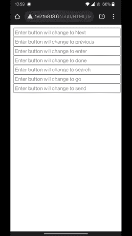

# HTML 输入键提示属性

> 原文:[https://www.geeksforgeeks.org/html-enterkeyhint-attribute/](https://www.geeksforgeeks.org/html-enterkeyhint-attribute/)

在本文中，我们将了解 HTML 中的 entrykeyhint 属性。enterkeyhint 属性是一个枚举属性，它指定在虚拟键盘上为 enter 键呈现什么操作标签。这是[全局属性](https://www.geeksforgeeks.org/html-global-attributes/) &允许作者自定义回车键的显示，以便对用户更有帮助。

在日常生活中，我们使用智能手机。我们已经注意到手机键盘的回车键，因为它总是根据要执行的动作而变化，比如当我们打字时，有时它的行为像回车键，同样的键有时也像搜索引擎上的搜索按钮，等等。这一切都是因为 enterkeyhint 属性。enterkeyhint 属性中有很多值，可以根据我们在那里指定的值来工作。

**语法:**

```html
<input enterkeyhint = "values">
```

**属性值:**

*   **完成:**当没有更多要输入的内容，输入法编辑器将关闭。
*   **输入:**当有更多的东西要写，但在新的一行。
*   **go:** 当我们写完表单，想继续下一个目标或表单时。
*   **搜索:**当我们必须在输入后搜索任何东西时，我们将使用这个。
*   **发送:**用于发送消息。
*   **下一步:**它将把用户带到下一个接受文本的字段。
*   **上一个:**它会将用户带到将接受文本的上一个字段。

**示例:**本示例通过指定不同的值来描述 enterkeyhint 属性&的用法。

## 超文本标记语言

```html
<!DOCTYPE html>
<html lang="en">

<head>
    <meta charset="UTF-8">
    <meta http-equiv="X-UA-Compatible" content="IE=edge">
    <meta name="viewport" content="width=device-width, initial-scale=1.0">
    <title>HTML enterkeyhint attributes</title>
</head>

<body>
    <form>
        <input placeholder="Enter button will change to Next" 
               enterkeyhint="next">
        <input placeholder="Enter button will change to previous" 
               enterkeyhint="previous">
        <input placeholder="Enter button will change to enter" 
               enterkeyhint="enter">
        <input placeholder="Enter button will change to done" 
               enterkeyhint="done">
        <input placeholder="Enter button will change to search" 
               enterkeyhint="search">
        <input placeholder="Enter button will change to go" 
               enterkeyhint="go">
        <input placeholder="Enter button will change to send" 
               enterkeyhint="send">
    </form>
</body>

</html>
```

**输出:**在输出中可以注意到，每次回车键图标都会根据其属性发生变化。



输出

**支持的浏览器:**

*   谷歌 Chrome 77
*   Firefox 94
*   微软 Edge 79
*   Safari 13.1
*   歌剧 66
*   网页视图安卓 77