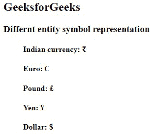

# HTML Entities

> 原文：[https://www.geeksforgeeks.org/html-entities/](https://www.geeksforgeeks.org/html-entities/)

**Example:** In this example, we have represented different entity symbols in HTML.

## HTML

```html
<!DOCTYPE html>
<html>
<body>
    <h2>GeeksforGeeks</h2>
    <div class="container">
        <h3>Different entity symbol representation</h3>
        <ul style="list-style-type:none;">
            <li>
                <h4>Indian currency: ₹</h4>
            </li>
            <li>
                <h4>Euro: €</h4>
            </li>
            <li>
                <h4>Pound: £</h4>
            </li>
            <li>
                <h4>Yen: ¥</h4>
            </li>
            <li>
                <h4>Dollar: {content}lt;/h4>
            </li>
        </ul>
    </div>
</body>
</html>
```

**Output:**



HTML provides some method to display reserved characters. Reserved characters are those characters that are either reserved for HTML or those which are not present in the basic keyboard. For instance, ‘<‘ is reserved in HTML language. Sometimes this character needs to display on the web page which creates ambiguity in code. Along with these are the characters which are normally not present in basic keyboard ( £, ¥, €, © ) etc. HTML provides some Entity names and Entity numbers to use these symbols. Entity names are case sensitive. Entity number is easy to learn. 

**Syntax:**

```html
&entity_name; or &#entity_number;
```

Some useful Symbols with their Entity name and Entity numbers are listed below: 

<figure class="table">

| 

#### Notation

 | 

#### Symbols

 | 

#### Entity name

 | 

#### Entity Number

 |
| --- | --- | --- | --- |
|  | non-breaking space | `&nbsp;` |  |
| `<` | less than | `&lt;` | `<` |
| `®` | registered trademark | `&reg;` | `®` |
| `©` | copyright | `&copy;` | `©` |
| `€` | euro | `&euro;` | `€` |
| `¥` | yen | `&yen;` | `¥` |
| `£` | pound | `&pound;` | `£` |
| `¢` | cent | `&cent;` | `¢` |
| `“` | double quotation mark | `&quot;` | `"` |
| `&` | ampersand | `&amp;` | `&` |
| `>` | greater than | `&gt;` | `>` |
| `∂` | PARTIAL DIFFERENTIAL | `&part;` | `∂` |
| `∃` | THERE EXISTS | `&exist;` | `∃` |
| `∅` | EMPTY SETS | `&empty;` | `∅` |
| `∇` | NABLA | `&nabla;` | `∇` |
| `∈` | ELEMENT OF | `&isin;` | `∈` |
| `∉` | NOT AN ELEMENT OF | `&notin;` | `∉` |
| `∋` | CONTAINS AS MEMBER | `&ni;` | `∋` |
| `∏` | N-ARY PRODUCT | `&prod;` | `∏` |
| `∑` | N-ARY SUMMATION | `&sum;` | `∑` |
| `Α` | Alpha | `&Alpha;` | `Α` |
| `Β` | Beta | `&Beta;` | `Β` |
| `Γ` | Gamma | `&Gamma;` | `Γ` |
| `Δ` | delta | `&Delta;` | `Δ` |
| `Ε` | Epsilon | `&Epsilon;` | `Ε` |
| `Ζ` | Zeta | `&Zeta;` | `Ζ` |
| `♥` | BLACK HEART SUIT | `&hearts;` | `♥` |
| `♣` | BLACK CLUB SUIT | `&clubs;` | `♣` |
| `♠` | BLACK SPADE SUIT | `&spades;` | `♠` |
| `↓` | DOWNWARDS ARROW | `&darr;` | `↓` |
| `→` | RIGHTWARDS ARROW | `&rarr;` | `→` |
| `↑` | UPWARDS ARROW | `&uarr;` | `↑` |
| `←` | LEFTWARDS ARROW | `&larr;` | `←` |
| `™` | TRADEMARK | `&trade;` | `™` |
| `♦` | BLACK DIAMOND SUIT | `&#x2666;` | `♦` |
| `°` | degree | `&deg;` | `°` |
| `∞` | infinity | `&infin;` | `∞` |
| `‰` | per-mille | `&permil;` | `‰` |
| `⋅` | multiplication dot | `&sdot;` | `⋅` |
| `±` | plus-minus | `&plusmn;` | `±` |
| `†` | hermitian | `&dagger;` | `†` |
| `—` | `–` | `&mdash;` | `—` |
| `¬` | `–` | `&not;` | `¬` |
| `µ` | Micro (mu) | `&micro;` | `µ` |
| `⊥` | falsum | `&perp;` | `⊥` |
| `∥` | parallel | `&par;` | `∥` |

</figure>

**Reserved Characters:** These characters are either reserved for HTML or those which are not present in the basic keyboard & can’t use them directly.

**Example:** Here, a few of the reserved characters are discussed:

<figure class="table">

| 

#### Reserved Character

 | 

#### Entity Name

 |
| --- | --- |
| `&` | `&amp;` |
| `<` | `&lt;` |
| `>` | `&gt;` |
| `“` | `&quot;` |

</figure>

**Other Characters:** Some characters that aren’t available directly on our keyboard, therefore such an entity can be used to represent it by using their entity number. 

**Example:** These keywords are directly not available to type, we need to specify their entity number. Here #x before the numbers represents the hexadecimal representation.

<figure class="table">

| 

#### Character

 | 

#### Entities

 |
| --- | --- |
| `≥` | `&GreaterEqual;` |
| `©` | `&copy;` |
| `€` | `&euro;` |
| `∃` | `&exist;` |

</figure>

**Example:**

## HTML

```html
<!DOCTYPE html>
<html>
<head>
    <title>HTML Entities</title>
</head>

<body>

<p>Showing euro €</p>

<p>Showing cent ¢</p>

<p>Showing Copyright ©</p>

<p>Showing BLACK DIAMOND SUIT ♦</p>

<p>Showing TRADEMARK ™</p>

</body>
</html>
```

**Output**  


**Advantage of HTML Entity:**

*   Entity names can be easy to remember.

**Disadvantages:**

*   Browsers might not support all the entity names, instead, they can support the use of entity numbers.

**Non-breaking Space:** It is used to provide the space that will not break into a new line. This HTML entity is represented by *&nbsp;* that will separate the 2 words & will stick together without breaking it into a new line. We can also use the non-breaking space for preventing the browsers from truncating spaces in HTML pages. The non-breaking hyphen (‑) is used to define a hyphen character (‑) that does not break into a new line.

**Example:**

1.  12:00 PM
2.  256 km/h

If we use to write 10 spaces in our text, then the browser will remove 9 of them. In order to add real spaces in our text, we can use the character entity.

**Diacritical Marks:** A diacritical mark is a “glyph” added to a letter. Diacritical marks like grave **( ` ̀)** and acute **(** **́** **)** are called accents. It can appear both above and below a letter, inside a letter, and between two letters. Diacritical marks can be used in combination with alphanumeric characters to generate a character that is not present in the character set (encoding) used on the page. Here is the list of some diacritical marks

<figure class="table">

| 

#### Symbols

 | 

#### Character

 | 

#### Entity Number

 | 

#### Final Result

 |
| --- | --- | --- | --- |
| ` ̀` | `a` | `à` | `à` |
| ` ́` | `a` | `á` | `á` |
| `̂` | `a` | `â` | `â` |
| ` ̃` | `a` | `ã` | `ã` |
| ` ̀` | `O` | `Ò` | `Ò` |
| ` ́` | `O` | `Ó` | `Ó` |
| `̂` | `O` | `Ô` | `Ô` |
| ` ̃` | `O` | `Õ` | `Õ` |

</figure>

**Supported Browser:**

*   Google Chrome
*   Microsoft Edge
*   Firefox
*   Opera
*   Safari