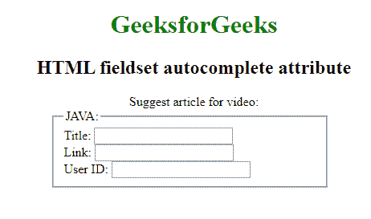

# HTML |

<fieldset>autocomplete attribute

> 原文:[https://www . geesforgeks . org/html-field set-autocomplete-attribute/](https://www.geeksforgeeks.org/html-fieldset-autocomplete-attribute/)

**HTML <字段集>自动完成属性**用于指定*字段集有自动完成开或关值*。当浏览器上的自动完成属性设置为时，将自动完成用户之前输入的值。

**语法:**

```html
<fieldset autocomplete="on | off">
```

**属性值:**

*   **开:**有默认值。当浏览器上的自动完成属性设置为时，将自动完成用户之前输入的值。
*   **关闭:**用户应该已经为每次使用输入了每个字段的值。浏览器不应自动完成条目。

**示例:**本示例说明了 **<字段集>自动完成的使用。**

```html
<!DOCTYPE html>
<html> 
    <head> 
        <title>fieldset autocomplete </title> 
        <style> 
            h1, h2, .titl{ 
                text-align:center; 
            } 
            fieldset { 
                width:50%; 
                margin-left:22%; 
            } 
            h1 { 
                color:green; 
            } 
        </style> 
    </head> 
    <body> 
        <h1>GeeksforGeeks</h1> 
        <h2> HTML fieldset autocomplete attribute</h2> 
        <form> 
            <div class="titl">Suggest article for video:</div> 
            <fieldset autocomplete ="on"> 
                <legend>JAVA:</legend> 
                Title: <input type="text"><br> 
                Link: <input type="text"><br> 
                User ID: <input type="text"> 
            </fieldset> 
            <br> 

        </form> 
    </body> 
</html>
```

 ****输出:**


**支持的浏览器:**支持的浏览器 **<字段集>自动完成属性**如下所列:

*   谷歌铬
*   微软公司出品的 web 浏览器
*   red fox
*   苹果旅行队
*   歌剧

T30**</fieldset>