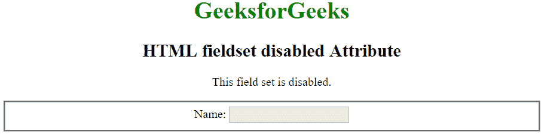

# HTML

<fieldset>disabled Attribute

> 原文:[https://www . geesforgeks . org/html-field set-disabled-attribute/](https://www.geeksforgeeks.org/html-fieldset-disabled-attribute/)

HTML 中<字段集>元素的**禁用**属性用于指定相关表单元素组被禁用。禁用的字段集不可点击且不可用。它是一个布尔属性。

**语法:**

```html
<fieldset disabled>fieldset content...</fieldset>

```

**示例:**

```html
<!DOCTYPE html> 
<html> 
    <head> 
        <title>HTML fieldset disabled Attribute</title> 
    </head> 
    <body style = "text-align:center">    

        <h1 style = "color: green;">GeeksforGeeks</h1>
        <h2>HTML fieldset disabled Attribute</h2>

        <p>This field set is disabled.</p>

        <!--A disabled fieldset-->
        <fieldset disabled>
          Name: <input type="text"><br>
        </fieldset>

    </body> 
</html>      
```

**输出:**


**支持的浏览器:**禁用属性<字段集>支持的浏览器如下:

*   苹果 Safari 8.0
*   谷歌 Chrome
*   火狐浏览器
*   歌剧
*   不支持 Internet Explorer

</fieldset>