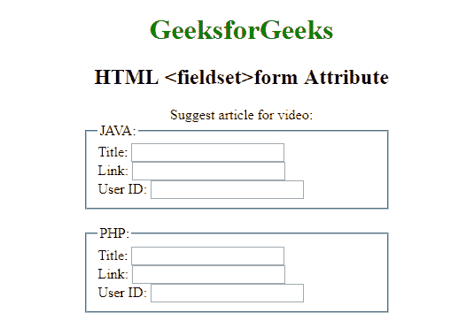

# HTML |

<fieldset>form Attribute

> 原文:[https://www.geeksforgeeks.org/html-fieldset-form-attribute/](https://www.geeksforgeeks.org/html-fieldset-form-attribute/)

**HTML | <字段集>表单属性**用于指定*一个或多个<字段集>元素所属的表单*。

**语法:**

```html
<fieldset form="form_id">
```

**属性值:**

*   **form_id:** 包含值 **form_id** ，指定 **<字段集>** 元素所属的表单数量。该属性的值应该是 **<表单>** 元素的 id。

**示例:**

```html
<!DOCTYPE html>
<html>

<head>
    <title>
        HTML fieldset form Attribute
    </title>
    <style>
        h1,
        h2,
        .title {
            text-align: center;
        }

        fieldset {
            width: 50%;
            margin-left: 22%;
        }

        h1 {
            color: green;
        }
    </style>
</head>

<body>
    <h1>GeeksforGeeks</h1>
    <h2>
      HTML <fieldset> 
      form Attribute
  </h2>
    <form id="mygeeks">
        <div class="titl">
            Suggest article for video:
        </div>
    </form>

    <fieldset form="mygeeks">
        <legend>JAVA:</legend>
        Title:
        <input type="text">
        <br> Link:
        <input type="text">
        <br> User ID:
        <input type="text">
    </fieldset>
    <br>
    <fieldset form="mygeeks">
        <legend>PHP:</legend>
        Title:
        <input type="text">
        <br> Link:
        <input type="text">
        <br> User ID:
        <input type="text">
    </fieldset>

</body>

</html>
```

**输出:**


**支持的浏览器:**以下列出了 **HTML <字段集>表单属性**支持的浏览器:

*   谷歌 Chrome
*   微软公司出品的 web 浏览器
*   火狐浏览器
*   歌剧
*   旅行队

</fieldset>