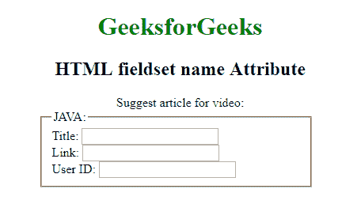

# HTML |

<fieldset>name Attribute

> 原文:[https://www.geeksforgeeks.org/html-fieldset-name-attribute/](https://www.geeksforgeeks.org/html-fieldset-name-attribute/)

**HTML <字段集>名称属性**用于*指定字段集元素*的名称。它用于在提交表单后引用表单数据，或者引用 JavaScript 中的元素。

**语法:**

```html
<fieldset name="text"> 
```

**属性值:**它包含值，即**名称**，指定字段集元素的名称。

**示例:**

```html
<!DOCTYPE html>
<html>

<head>
    <title>
        HTML fieldset name Attribute
    </title>

    <style>

        fieldset {
            width: 50%;
            margin-left: 22%;
        }

        h1 {
            color: green;
        }

        button {
            margin-left: 35%;
        }
    </style>
</head>

<body>
    <h1 style="">GeeksforGeeks</h1>
    <h2 style="">HTML fieldset name Attribute</h2>

    <form id="myGeeks">
        <div class="titl">
            Suggest article for video:
        </div>

        <fieldset id="GFG" name="Geek_field" >
            <legend>JAVA:</legend>
            Title:
            <input type="text">
            <br> Link:
            <input type="text">
            <br> User ID:
            <input type="text">
        </fieldset>
    </form>
    <br>

</body>

</html>
```

**输出:**


**支持的浏览器:**

*   谷歌 Chrome
*   火狐浏览器
*   歌剧
*   苹果 Safari

</fieldset>