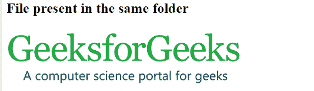
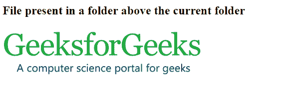
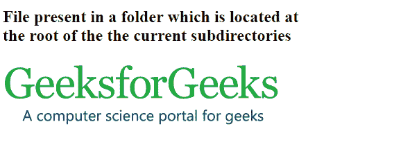

# HTML |文件路径

> 原文:[https://www.geeksforgeeks.org/html-file-paths/](https://www.geeksforgeeks.org/html-file-paths/)

文件路径指定文件在 web 文件夹结构中的位置。它就像一个文件的地址，帮助网络浏览器访问文件。文件路径用于链接外部资源，如图像、视频、样式表、JavaScript、显示其他网页等。
要在网页中插入文件，必须知道其来源。例如，语法()用于插入图像文件，其中文件的路径在源(src)中提到。
文件路径有两种类型:

*   绝对文件路径
*   相对文件路径

**绝对文件路径:**描述访问互联网文件的完整地址(URL)。

> 

**例:**

## 超文本标记语言

```html
<!DOCTYPE html>
<html>
    <head>
        <title>Absolute file path</title>
    </head>
    <body>
        
    </body>
</html>                   
```

**输出:**


**相对文件路径:**描述文件相对于当前网页文件位置的路径。
**示例 1:** 它显示了当前网页文件的同一文件夹中存在的文件的路径。

## 超文本标记语言

```html
<!DOCTYPE html>
<html>
    <head>
        <title>Relative file path</title>
    </head>
    <body>
        <h2>File present in the same folder</h2>
        
    </body>
</html>                   
```

**输出:**



**示例 2:** 它显示了当前网页文件所在文件夹上方的文件夹中存在的文件的路径。图像文件存在于一个名为 images 的文件夹中，当前网页文件存在于一个子文件夹中，那么代码如下:

## 超文本标记语言

```html
<!DOCTYPE html>
<html>
    <head>
        <title>Relative file path</title>
    </head>
    <body>
        <h2>File present in a folder above the current folder</h2>
        
    </body>
</html>                   
```

**输出:**



**示例 3:** 它显示了位于当前子目录根目录下的文件夹中文件的路径。

## 超文本标记语言

```html
<!DOCTYPE html>
<html>
    <head>
        <title>Relative file path</title>
    </head>
    <body>
        <h2>File present in a folder which is located at<br>
        the root of the current subdirectories</h2>
        
    </body>
</html>                   
```

**输出:**



**支持的浏览器:**

*   谷歌 Chrome
*   微软边缘
*   火狐浏览器
*   歌剧
*   狩猎

CSS 是网页的基础，通过设计网站和网络应用程序用于网页开发。你可以通过以下 [CSS 教程](https://www.geeksforgeeks.org/css-tutorials/)和 [CSS 示例](https://www.geeksforgeeks.org/css-examples/)从头开始学习 CSS。