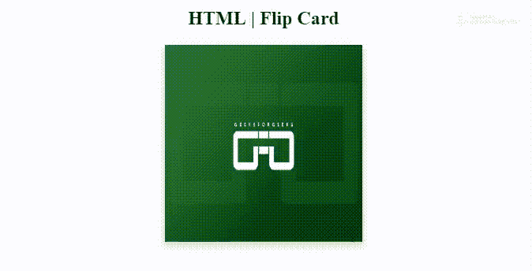

# HTML |翻牌

> 原文:[https://www.geeksforgeeks.org/html-flip-a-card/](https://www.geeksforgeeks.org/html-flip-a-card/)

翻转卡片是你网站中的卡片，当你将鼠标悬停在上面时，它们会翻转。当你将鼠标悬停在卡片上时，卡片背面会出现信息、链接或图像。

在本文中，您将学习如何仅使用 HTML 和 CSS 在您的网站上制作 Flip 卡。

**卡片的 HTML 文件:**

```html
<div class="card">
    <h2>HTML | Flip a Card</h2>

    <div class="card-inner">
        <div class="card-front">

            <!-- adding picture in the card -->
            
        </div>

        <!-- Decorate card back side -->
        <div class="card-back">
            <h1>GeeksforGeeks</h1>
            <p>A Computer Science Portal for Geeks</p>

            <a href="">
               Try our ide
            </a>
        </div>
    </div>
</div>
```

**使用 CSS 装饰卡片的正面和背面:**在 HTML 部分构建了卡片两面的结构。现在我们首先需要隐藏背面。因此，我们通过**背面-可见性:隐藏 CSS 的**属性并将其应用于*牌-正面*和*牌-背面*类，这样当正面可见时，背面被隐藏，反之亦然。关键是利用 CSS 的**变换**属性，将元素旋转 180 度，即**变换:rotateY(180 度)**。

```html
<style> .card {
    width: 250px;
    height: 250px;
    perspective: 1000px;
}
.card-inner {
    position: relative;
    text-align: center;
    transition: transform 0.6s;
    transform-style: preserve-3d;
}
.card:hover .card-inner {
    transform: rotateY(180deg);
}
.card-front, .card-back {
    position: absolute;
    backface-visibility: hidden;
}
.card-back {
    transform: rotateY(180deg);
}
</style>
```

**注意:**你可以根据**变换:旋转(180 度)**尽可能多的旋转你的牌。如果你减少角度和增加角度旋转取决于此，你也可以垂直翻转卡片。

**示例:**本示例使用**变换:rotateY(180 度)**属性翻转/旋转图像。如果你把 Y 轴改为 X 轴，那么卡片将改变翻转方向。

```html
<!DOCTYPE html>
<html>

<head>
    <meta name="viewport" 
            content="width=device-width, initial-scale=1">

    <!-- CSS code -->
    <style>
        h1 {
            color: green;
        }
        a {
            color: purple;
            text-decoration: none;
        }
        .card {
            background-color: transparent;
            width: 250px;
            height: 250px;
            perspective: 1000px;
        }
        .card-inner {
            position: relative;
            width: 100%;
            height: 100%;
            text-align: center;
            transition: transform 0.6s;
            transform-style: preserve-3d;
            box-shadow: 0 4px 8px 0 rgba(0, 0, 0, 0.2);
        }
        .card:hover .card-inner {
            transform: rotateY(180deg);
        }
        .card-front, .card-back {
            position: absolute;
            width: 100%;
            height: 100%;
            backface-visibility: hidden;
        }
        .card-front {
            background-color: #bbb;
            color: black;
        }
        .card-back {
            background-color: white;
            transform: rotateY(180deg);
        }
    </style>
</head>

<body>
    <center>
        <div class="card">
            <h2>HTML | Flip Card</h2>
            <div class="card-inner">
                <div class="card-front">
                    
                </div>

                <div class="card-back">
                    <h1>GeeksforGeeks</h1>
                    <p>A Computer Science Portal for Geeks</p>

                    <a href="https://ide.geeksforgeeks.org/tryit.php">
                        Try our ide
                    </a>
                </div>
            </div>
        </div>
    </center>
</body>

</html>
```

**输出:**
