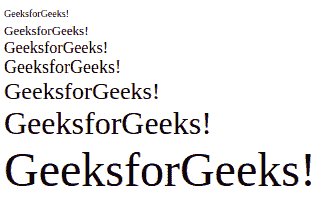
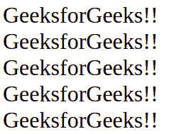

# HTML font 标签

> 哎哎哎:# t0]https://www . geeksforgeeks . org/html 字体标记/

**示例:**在本例中，我们使用字体标签作为 p 标签中的字体大小。

## 超文本标记语言

```html
<!DOCTYPE html>
<html>
<body>

    <h2>Welcome to GeeksforGeeks</h2>
    <!--Normal paragraph tag is used in below paragraph-->
    <p>Hello Geeks!.</p>

    <!--font tag is used in below paragraph-->
    <p style="font-size:30px">
      Welcome to GeeksforGeeks
    </p>

</body>
</html>
```

**输出:**


<font>标签在网页中起着重要的作用，以创建一个有吸引力和可读性的网页。字体标签用于更改文本的颜色、大小和样式。基本字体标签用于将所有文本设置为相同的大小、颜色和字体。</font> 

字体标签基本上有三个属性，如下所示:

*   [字号属性](https://www.geeksforgeeks.org/html-font-size-attribute/)
*   [人脸/类型属性](https://www.geeksforgeeks.org/html-font-face-attribute/)
*   [颜色属性](https://www.geeksforgeeks.org/html-font-color-attribute/)

[**字体大小:**](https://www.geeksforgeeks.org/html-font-size-attribute/) 该属性用于使用带有大小属性的字体标签来调整 HTML 文档中文本的大小。HTML 中字体的大小范围是 1 到 7，默认大小是 3。

**示例:**

## 超文本标记语言

```html
<!DOCTYPE html>

<html>

    <body>
        <!--HTML font size tag starts here-->
        <font size = "1">GeeksforGeeks!</font><br />
        <font size = "2">GeeksforGeeks!</font><br />
        <font size = "3">GeeksforGeeks!</font><br />
        <font size = "4">GeeksforGeeks!</font><br />
        <font size = "5">GeeksforGeeks!</font><br />
        <font size = "6">GeeksforGeeks!</font><br />
        <font size = "7">GeeksforGeeks!</font>
        <!--HTML font size tag ends here-->
    </body>

</html>                    
```

**输出:**



[**字体类型**](https://www.geeksforgeeks.org/html-font-face-attribute/)【T4:字体类型可以在 HTML 文档中使用带有字体标签的人脸属性进行设置。但是用户使用的字体需要先安装在系统中。

**示例:**

## 超文本标记语言

```html
<!DOCTYPE html>
<html>

    <body>
        <!--HTML font face tag starts here-->
        <font face = "Times New Roman" size = "6">
            GeeksforGeeks!!
        </font><br />
        <font face = "Verdana" size = "6">
            GeeksforGeeks!!
        </font><br />
        <font face = "Comic sans MS" size =" 6">
            GeeksforGeeks!!
        </font><br />
        <font face = "WildWest" size = "6">
            GeeksforGeeks!!
        </font><br />
        <font face = "Bedrock" size = "6">
            GeeksforGeeks!!
        </font><br />
        <!--HTML font face tag ends here-->
    </body>

</html>                    
```

**输出:**



[**字体颜色:**](https://www.geeksforgeeks.org/html-font-color-attribute/) 字体颜色用于在 HTML 文档中使用带有颜色属性的字体标签来设置文本颜色。可以用颜色的名称或十六进制代码来指定颜色。

**示例:**

## 超文本标记语言

```html
<!DOCTYPE html>
<html>

    <body>
        <!--HTML font color tag starts here-->
        <font color = "#009900">GeeksforGeeks</font><br />
        <font color = "green">GeeksforGeeks</font>
        <!--HTML font color tag ends here-->
    </body>
</html>                    
```

**输出:**


**注意:**html 5 不支持字体标签。

**支持的浏览器:**

*   谷歌 Chrome
*   微软 Edge 12 及以上版本
*   微软公司出品的 web 浏览器
*   火狐浏览器
*   歌剧
*   旅行队