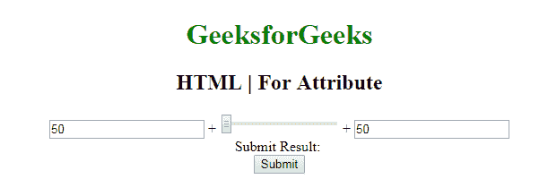

# HTML |为属性

> 原文:[https://www.geeksforgeeks.org/html-for-attribute/](https://www.geeksforgeeks.org/html-for-attribute/)

属性的 **HTML |在 **<标签>** 和 **<输出>** 元素中使用。
**对于标签元素中的属性:**当出现在标签元素中时，用于指定标签绑定到的表单元素的类型。** 

**支持的标签:**

*   **<标签>**
*   **<输出>**

**语法:**

```html
<label for="element_id">
```

**属性值:**它包含值，即 element_id，指定支持的绑定到的元素的 id。

**示例-1:** 本示例说明了标签元素中 for 属性的使用。

## 超文本标记语言

```html
<!-- HTML code to illustrates label tag -->
<!DOCTYPE html>
<html>

<head>
    <title>
      HTML | for Attribute
  </title>

    <style>
        body {
            font-size: 20px;
        }
    </style>
</head>

<body style="text-align:center">

    <h1 style="color:green">
      GeeksforGeeks
  </h1>
    <h2>HTML | for Attribute</h2>

    <form>

        <!-- Starts label tag from here -->
        <label for="student">
            Student
        </label>
        <input type="radio"
               name="Occupation"
               id="student"
               value="student">
        <br>

        <label for="business">
            Business
        </label>
        <input type="radio"
               name="Occupation"
               id="business"
               value="business">
        <br>

        <label for="other">
            Other
        </label>
        <!-- Ends label tags here -->

        <input type="radio"
               name="Occupation"
               id="other"
               value="other">
    </form>
</body>

</html>
```

**输出:**


**对于输出元素中的属性:**当出现在输出元素中时，它指定结果和计算之间的关系。

**语法:**

```html
<output for="element_id">
```

**示例-2:** 本示例说明了输出元素中的 For 属性的使用。

## 超文本标记语言

```html
<!DOCTYPE html>
<html>

<head>
    <title>
      HTML | For Attribute
  </title>
    <style>
        body {
            text-align: center;
        }

        h1 {
            color: green;
        }
    </style>
</head>

<body>
    <h1>GeeksforGeeks</h1>
    <h2>HTML | For Attribute</h2>
    <form oninput="sumresult.value = parseInt(A.value)
                + parseInt(B.value) + parseInt(C.value)">
        <input type="number"
               name="A"
               value="50" /> +

        <input type="range"
               name="B"
               value="0" /> +

        <input type="number"
               name="C"
               value="50" />
        <br /> Submit Result:
        <output name="sumresult"
                for="A B C">
      </output>
        <br>
        <input type="submit">
    </form>
</body>

</html>
```

**输出:**



**支持的浏览器:**属性的 *HTML 支持的浏览器如下:* 

*   谷歌 Chrome
*   微软公司出品的 web 浏览器
*   火狐浏览器
*   歌剧
*   旅行队