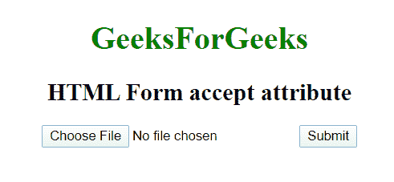

# HTML |

<form>accept Attribute

> 原文:[https://www.geeksforgeeks.org/html-form-accept-attribute/](https://www.geeksforgeeks.org/html-form-accept-attribute/)

HTML 中的 **<表单>接受属性**用于指定服务器接受的文件类型。该属性只能与 **<表单类型=【文件】>** 元素一起使用。此属性不用于验证工具，因为文件上载应该在服务器上进行验证。

**语法:**

```html
<form accept = "file_type";>
```

**属性值:**

*   **file_type:** 可以保存一个或多个可以提交/上传到服务器的文件类型。可以添加多个文件，并用逗号分隔。

**示例:**

```html
<!DOCTYPE html> 
<html> 

<head> 
    <title> 
        HTML form accept attribute 
    </title> 

    <style> 
        body { 
            text-align: center; 
        } 

        h1 { 
            color: green; 
        } 
    </style> 
</head> 

<body> 
    <h1>GeeksForGeeks</h1> 

    <h2> 
        HTML Form accept attribute 
    </h2>

    <form action=" "accept="image/*"> 
        <input type="file"
            name="picture"> 

        <input type="submit"> 
    </form> 
</body> 

</html>
```

**输出:**


**支持的浏览器:**任何浏览器都不支持该属性。

</form>