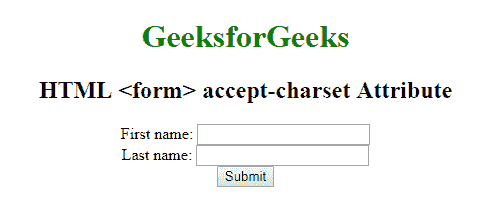

# HTML |

<form>accept-charset Attribute

> 原文:[https://www . geesforgeks . org/html-form-accept-charset-attribute/](https://www.geeksforgeeks.org/html-form-accept-charset-attribute/)

**HTML <表单>接受字符集属性**用于*定义字符编码，用于表单提交*。accept-charset 属性的默认值是**“未知”**字符串，表示编码等于包含 **<表单>** 元素的文档的编码。

**语法:**

```html
<form accept-charset = "character_set">
```

**属性值:**属性值包含一个或多个编码属性的列表分隔值。编码属性的通用值是 UTF-8，ISO-8859-1。此属性始终仅与表单元素相关联。

**示例:**

```html
<!DOCTYPE html>
<html>

<head>
    <title>
      HTML form accept-charset attribute
  </title>
    <style>
        h1 {
            color: green;
        }

        body {
            text-align: center;
        }
    </style>
</head>

<body>
    <h1>GeeksforGeeks</h1>
    <h2>
      HTML <form> accept-charset Attribute
  </h2>

    <form action="#" accept-charset="UTF-8">
        First name:
        <input type="text" name="fname">
        <br> Last name:
        <input type="text" name="lname">
        <br>
        <input type="submit" value="Submit">
    </form>
</body>

</html>
```

**输出:**


**支持的浏览器:****HTML<表单>接受字符集属性**支持的浏览器如下:

*   谷歌 Chrome
*   微软公司出品的 web 浏览器
*   火狐浏览器
*   苹果 Safari
*   歌剧

</form>