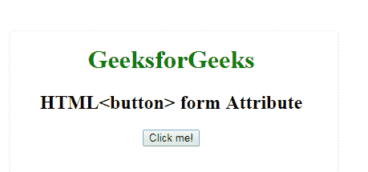

# HTML |表单属性

> 原文:[https://www.geeksforgeeks.org/html-form-attribute/](https://www.geeksforgeeks.org/html-form-attribute/)

**HTML 表单属性**用于指定元素可以包含一个或多个表单。该属性可用于以下元素，如:

*   [HTML | <按钮>表单属性](https://www.geeksforgeeks.org/html-button-form-attribute/)
*   [HTML | <字段集>表单属性](https://www.geeksforgeeks.org/html-fieldset-form-attribute/)
*   [HTML | <输入>表单属性](#)
*   [HTML | <标签>表单属性](#)
*   [HTML | <米>形态属性](#)
*   [HTML | <对象>表单属性](#)
*   [HTML | <输出>表单属性](#)
*   [HTML | <选择>表单属性](#)
*   [HTML | <文本区>表单属性](#)
*   [HTML | < keygen >表单属性](https://www.geeksforgeeks.org/html-keygen-form-attribute/)

**语法:**

```html
<element form="form_id"> 
```

**属性值:**它包含单个值 **form_id** ，该值包含指定按钮元素所属的一个或多个的值，即 form_id。该属性的值应该是<表单>元素的 id。
**例:**

## 超文本标记语言

```html
<!DOCTYPE html>
<html>

<head>
    <title>
        HTML button form Attribute
    </title>
</head>

<body style="text-align:center">

    <h1 style="color:green;">
        GeeksforGeeks
    </h1>

    <h2>
        HTML <button> form Attribute
    </h2>

    <form id="myGeeks"></form>

    <button id="btn" name="myGeeks" form="myGeeks"
            onclick="geek()">
        Click me!
    </button>
</body>

</html>                   
```

**输出:**



**支持的浏览器:****HTML 表单属性**支持的浏览器如下:

*   谷歌 Chrome
*   Internet Explorer 10.0 +
*   火狐浏览器
*   歌剧
*   旅行队