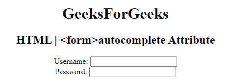

# HTML |

<form>autocomplete Attribute

> 原文:[https://www . geesforgeks . org/html-form-autocomplete-attribute/](https://www.geeksforgeeks.org/html-form-autocomplete-attribute/)

**HTML <表单>自动完成属性**用于指定*表单有自动完成开或关值*。当浏览器上的自动完成属性设置为时，将自动完成用户之前输入的值。
**语法:**

```html
<form autocomplete="on|off">
```

**属性值:**

*   **开:**有默认值。当浏览器上的自动完成属性设置为时，将自动完成用户之前输入的值。

*   **关闭:**用户应该已经为每次使用输入了每个字段的值。浏览器不应自动完成条目。

**示例:**本示例说明了 **<表单>自动完成属性**的使用。

## 超文本标记语言

```html
<!DOCTYPE html>
<html>

<head>
    <title>
        HTML Form
      autocomplete Attribute
    </title>
</head>

<body style="text-align:center">

    <h1>
      GeeksForGeeks
  </h1>

    <h2>HTML | 
      <form>autocomplete
      Attribute
  </h2>

    <form action="#"
          method="post"
          id="users"
          autocomplete="on">

        <label for="username">
          Username:
      </label>

        <input type="text"
               name="username"
               id="Username">
        <br>

        <label for="password">
          Password:
      </label>

        <input type="password"
               name="password"
               id="password">
        <br>
        <br>
    </form>
</body>

</html>
```

**输出:**



**支持的浏览器:**表单>自动完成属性支持的浏览器如下:

*   谷歌 Chrome
*   微软公司出品的 web 浏览器
*   火狐浏览器
*   歌剧
*   旅行队

</form>