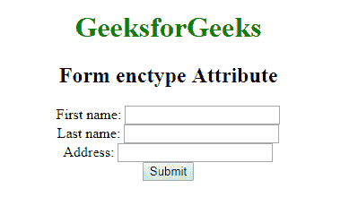

# HTML |

<form>enctype Attribute

> 原文:[https://www.geeksforgeeks.org/html-form-enctype-attribute/](https://www.geeksforgeeks.org/html-form-enctype-attribute/)

**HTML <表单> enctype 属性**用于指定*将呈现在表单中的数据在提交给服务器*时应该进行编码。只有在**方法=“开机自检”**的情况下，才能使用这种类型的属性。

**语法:**

```html
<form enctype="value"> 
```

**属性值:**该属性包含以下三个值:

*   **application/x-www-form-URL encoded:**为默认值。它在发送到服务器之前对所有字符进行编码。它将空格转换为 **+** 符号，将特殊字符转换为十六进制值。
*   **多部分/表单数据:**该值不编码任何字符。
*   **文本/普通:**该值将空格转换为 **+** 符号，但不转换特殊字符。

**示例:**本示例说明了 enctype 属性在<表单>元素中的使用。

```html
<!DOCTYPE html>
<html>

<head>
    <title>Form enctype attribute</title>
</head>

<body style="text-align: center">
    <h1 style="color: green">GeeksforGeeks</h1>
    <h2>Form enctype Attribute</h2>
    <form action="#"
          method="post" 
          enctype="multipart/form-data">
        First name:
        <input type="text" 
               name="fname">
        <br> Last name:
        <input type="text"
               name="lname">
        <br> Address:
        <input type="text" 
               name="Address">
        <br>
        <input type="submit"
               value="Submit">
    </form>
</body>

</html>
```

**输出:**


**支持的浏览器:****<表单> enctype 属性**支持的浏览器如下:

*   谷歌 Chrome
*   微软公司出品的 web 浏览器
*   火狐浏览器
*   苹果 Safari
*   歌剧

</form>