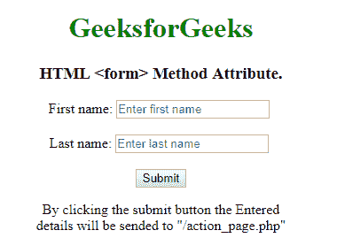
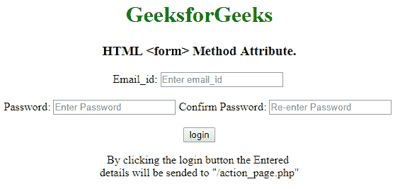

# HTMLmethod 属性

> 原文:[https://www.geeksforgeeks.org/html-form-method-attribute/](https://www.geeksforgeeks.org/html-form-method-attribute/)

**HTML <表单>方法属性**用于指定提交表单时发送数据的 HTTP 方法。HTTP 方式有两种，分别是 **GET** 和 **POST** 。方法属性可以与 **<一起构成>** 元素。
**属性值:**

*   **GET:** 在 GET 方法中，表单提交后，表单值会在新浏览器选项卡的地址栏中可见。它的大小限制在 3000 个字符左右。它仅适用于非安全数据，不适用于敏感信息。
*   **POST:** 在 POST 方法中，表单提交后，表单值在新浏览器选项卡的地址栏中将不会像在 GET 方法中一样可见。它将表单数据追加到 HTTP 请求的正文中。它没有大小限制。此方法不支持对结果添加书签。

**支持的标签:**

*   **<形态>**

**语法:**

```html
<form method="get|post">
```

**示例 1:** 此示例说明了 GET 方法属性的使用。

## 超文本标记语言

```html
<!DOCTYPE html>
<html>

<head>
    <title>
        HTML form method Attribute
    </title>
</head>

<body style="text-align:center;">

    <h1 style="color:green;">GeeksforGeeks</h1>

    <h3> HTML <form> Method Attribute. </h3>

    <form action="/action_page.php" id="users"
                action="#" method="GET" target="_blank">

        First name: <input type="text" name="fname"
                            placeholder="Enter first name">

        <br><br>
        Last name: <input type="text" name="lname"
                            placeholder="Enter last name">
        <br><br>

        <input type="submit" value="Submit">

    </form>

<p>
        By clicking the submit button the Entered<br>
        details will be sended to "/action_page.php"
    </p>

</body>

</html>                   
```

**输出:**



**示例 2:** 此示例说明了 POST 方法属性的使用。此方法将表单数据作为 HTTP 后事务发送。

## 超文本标记语言

```html
<!DOCTYPE html>
<html>

<head>
    <title>
        HTML form method Attribute
    </title>
</head>

<body style="text-align:center;">

    <h1 style="color:green;">GeeksforGeeks</h1>

    <h3>HTML <form> Method Attribute.</h3>

    <form action="/action_page.php" id="users"
            action="#" method="POST" target="_blank">

        Email_id: <input type="text" name="Email_id"
                    placeholder="Enter email_id">

        <br><br>

        Password: <input type="password"
                    placeholder="Enter Password">

        Confirm Password: <input type="password"
                    placeholder="Re-enter Password">

        <br><br>

        <input type="button" value="login">

    </form>

<p>
        By clicking the login button the Entered<br>
        details will be sended to "/action_page.php"
    </p>

</body>

</html>                   
```

**输出:**



**支持的浏览器:**

*   谷歌 Chrome
*   微软公司出品的 web 浏览器
*   Mozilla Firefox
*   旅行队
*   歌剧