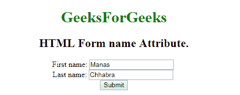

# HTML |

<form>name Attribute

> 原文:[https://www.geeksforgeeks.org/html-form-name-attribute/](https://www.geeksforgeeks.org/html-form-name-attribute/)

**HTML <表单>名称属性**用于*指定表单元素*的名称。它用于在提交表单后引用表单数据，或者引用 JavaScript 中的元素。

**语法:**

```html
<form name="name"> 
```

**属性值:**它包含一个单一的值名称，该名称描述了 **<表单>** 元素的名称。

**示例:**

```html
<!DOCTYPE html>
<html>

<body style="text-align:center;">
    <h1 style="color:green;"> 
    GeeksForGeeks 
</h1>

    <h2>HTML Form name Attribute.</h2>
    <form id="users" action="#" name="Geeks">
        First name:

        <input type="text" name="fname" value="Manas">
        <br> Last name:

        <input type="text" name="lname" value="Chhabra">
        <br>

        <input type="submit" value="Submit">
    </form>
</body>

</html>
```

**输出:**


**支持的浏览器:**

*   谷歌 Chrome
*   火狐浏览器
*   边缘
*   歌剧
*   苹果 Safari

</form>