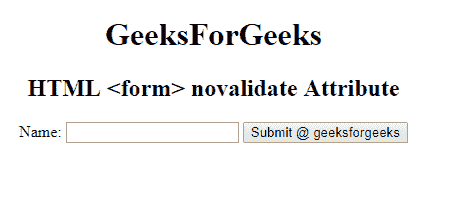

# HTML |

<form>novalidate Attribute

> 原文:[https://www . geesforgeks . org/html-form-novalidate-attribute/](https://www.geeksforgeeks.org/html-form-novalidate-attribute/)

**HTML <表单>更新属性**用于指定提交表单时不验证表单数据。它是一个布尔属性。

**语法:**

```html
 <form novalidate> 
```

**示例-1:** 本示例说明了**表单**元素中新力属性的使用。

```html
<!DOCTYPE html>
<html>

<head>
    <title>
        HTML <form> novalidate Attribute
    </title>
</head>

<body style="text-align:center;">
    <h1> 
        GeeksForGeeks 
    </h1>

    <h2> 
        HTML <form> novalidate Attribute
    </h2>

    <form action="#"
          method="get"
          target="_self"
          novalidate>
        Name:
        <input type="text">
        <input type="submit" 
               id="Geeks" 
               name="myGeeks"
               value="Submit @ geeksforgeeks" 
               formTarget="_blank">
    </form>

</body>

</html>
```

**输出:**


**支持的浏览器:****HTML 表单更新属性**支持的浏览器如下:

*   谷歌 Chrome 10.0
*   Internet Explorer 10.0
*   Firefox 4.0
*   歌剧 10.6

</form>