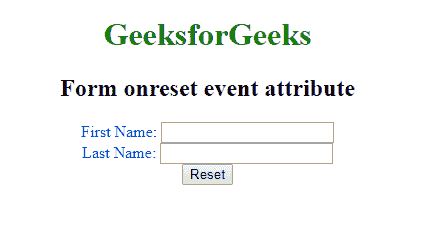

# HTML |

<form>onreset Attribute

> 原文:[https://www.geeksforgeeks.org/html-form-onreset-attribute/](https://www.geeksforgeeks.org/html-form-onreset-attribute/)

重置属性上的 **HTML <表单>用于指定表单重置字段。**

**语法:**

```html
<form onreset = "script">
```

**属性值:**该属性包含单值脚本，在执行设置事件调用时有效。

**示例:**

```html
<!DOCTYPE html > 
<html> 
    <head> 
        <title>
            HTML form onreset attribute
        </title> 

        <style> 
            body { 
                text-align:center; 
            } 
            h1 { 
                color:green; 
            } 
        </style> 

        <script> 
            function Geeks() { 
                alert("Form Reset...") ; 
            } 
        </script > 
    </head> 

    <body> 
        <h1>GeeksforGeeks</h1> 
        <h2>Form onreset event attribute</h2> 

        <form onreset="Geeks()" style="color:blue";> 
            First Name: <input type="text"></br> 
            Last Name: <input type="text"></br> 
            <input type="reset"> 
        </form> 
    </body> 
</html>                    
```

**输出:**


**支持的浏览器:**设置属性的<表单>支持的浏览器如下:

*   谷歌 Chrome
*   微软公司出品的 web 浏览器
*   火狐浏览器
*   旅行队
*   歌剧

</form>