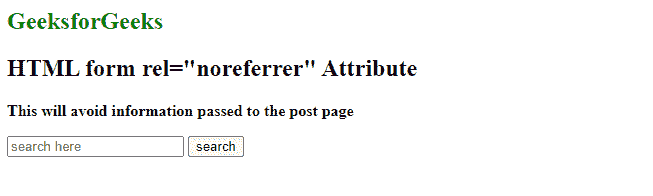
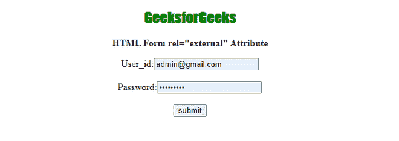

# HTML

<form>rel Attribute

> 原文:[https://www.geeksforgeeks.org/html-form-rel-attribute/](https://www.geeksforgeeks.org/html-form-rel-attribute/)

**HTML <表单> rel 属性**用于定义当前文档和链接文档之间的关系。**“rel”**代表关系。它表示，我们将外部 CSS 与 HTML 页面连接起来。

**语法:**

```html
<form rel="value">
```

**属性值:**

*   **外部:**指定外部文档不是当前站点的一部分。
*   **帮助:**指定帮助文档的链接。
*   **许可:**定义文档的版权信息。
*   **next:** 它指定选择中的下一个文档。
*   **nofollow:** 它指定谷歌搜索蜘蛛不应该跟随那个链接，并且大部分用于付费链接。
*   **noreferrer:** 它定义了如果用户跟随超链接，浏览器不应该发送 HTTP referrer 头。
*   **prev:** 定义选择中的上一个文档。
*   **搜索:**指定文档的搜索工具。

**例 1:**

## 超文本标记语言

```html
<!DOCTYPE html>
<html>

<body>
    <h2 style="color: green">GeeksforGeeks</h2>
    <h2>HTML form rel="noreferrer" Attribute</h2>

    <b>This will avoid information passed to the post page </b>

    <!-- It avoids passing the referrer information
        to target website by removing the referral 
        info from the HTTP header.
        It is safe to use -->
    <form rel="noreferrer" action="mypage.php">
        <input type="search" placeholder="search here" />
        <input type="button" value="search" />
    </form>
</body>

</html>
```

**输出:**



**例 2:**

## 超文本标记语言

```html
<!DOCTYPE html>
<html>

<head>
    <style>
        h2 {
            font-family: Impact;
            color: green;
        }

        body {
            text-align: center;
        }
    </style>
</head>

<body>
    <h2>GeeksforGeeks</h2>

    <b> HTML Form rel="external" Attribute </b>

    <!-- The referred document is not part 
        of the current site -->
    <form rel="external" action="mypage.php">
        User_id:<input type="text" /><br /><br />
        Password:<input type="password" /><br />
        <input type="submit" value="submit" />
    </form>
</body>

</html>
```

**输出:**



**支持的浏览器:**

*   谷歌 Chrome
*   微软公司出品的 web 浏览器
*   火狐浏览器
*   旅行队
*   歌剧

</form>