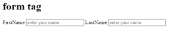

# HTML 表单标签

> 原文:[https://www.geeksforgeeks.org/html-form-tag/](https://www.geeksforgeeks.org/html-form-tag/)

**表单标签**

表单需要接受访问网站的用户的输入。这个表格基本上用于注册过程，登录你在网站上的个人资料，或者在网站上创建你的个人资料，等等。从表格中收集的信息是-1。名字 2。电子邮件地址等。现在，表单将从表单中获取输入，并在后端应用程序(如 PHP)中发布这些数据。因此后端应用程序将处理他们接收到的数据。我们可以使用各种表单元素，如文本字段、文本区域、下拉列表、选择、复选框、单选按钮等。

**语法:**

```html
<form> Form Content... </form>
```

**属性:**有许多属性与<表单>标签相关联。其中一些列举如下:

*   [**动作属性**](https://www.geeksforgeeks.org/html-formaction-attribute/)【T4:-用于表单提交后将数据发送到服务器。
*   [**方法**](https://www.geeksforgeeks.org/html-form-method-attribute/)**:**-这是用 Get 和 Post 两种方法上传数据。获取方法:-它的网址字符长度有限。-我们不应该用 get 发送一些敏感数据。-这种方法对非安全数据更好。发布方法:-1。它没有大小限制。提交的表格用的方法张贴，不能加书签。
*   [**Enctype 属性**](https://www.geeksforgeeks.org/html-form-enctype-attribute/):-该属性用于指定浏览器在将数据发送到服务器之前如何对数据进行解码。所以这个属性的值是:-1 . application/x-www-form-URL encoded-这是大多数表单在 2.multipart/form-data 使用的标准方法-当您有一些东西要上传时使用，比如图像文件、word 文件等。

**例如** **形式标记:-**

## 超文本标记语言

```html
<!DOCTYPE html>

<html>

<body>

   <h1>form tag </h1>

   <!--Here we have not used the action attribute
    as we are not submitting the data to the server-->

   <form>  

   <label for="fname">FirstName</label><!-- Here i have used label to
    define the label for input -->

   <input type="text" name="fname" placeholder="enter your name" required><!--It
    defines a text field by using input tag  -->

       <label for="lname">LastName</label>

   <input type="text" name="lname" placeholder="enter your name" required>

   </form>

   </body>

</html>
```

**输出:**



**支持的浏览器:**

*   谷歌 Chrome
*   微软公司出品的 web 浏览器
*   火狐浏览器
*   歌剧
*   旅行队