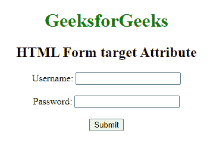
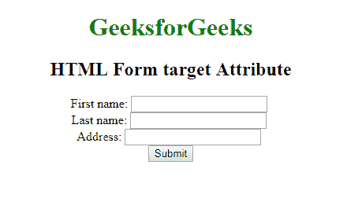

# HTML

<form>target Attribute

> 原文:[https://www.geeksforgeeks.org/html-form-target-attribute/](https://www.geeksforgeeks.org/html-form-target-attribute/)

**示例:**这个简单的示例说明了在 HTML 表单中设置为 *_blank* 的*目标*属性的使用。

## 超文本标记语言

```html
<!DOCTYPE html>
<html>
<head>
    <title>HTML Form target Attribute</title>
</head>

<body>
    <h1>GeeksforGeeks</h1>
    <h2>HTML Form target Attribute</h2>
    <form action="#" id="GFG" target="_blank">
          Username:
        <input type="text" name="name">
        <br>
        Password:
        <input type="password" name="password">
        <br>
        <input type="submit" value="Submit">
    </form>
</body>
</html>
```

**输出:**



HTML 中的 **<表单>目标属性**用于指定提交的结果是在**当前窗口**、**新选项卡**中打开，还是在**新框架** ie 中打开。，此属性指定一个名称或关键字，用于显示提交表单后显示回复的位置。

**语法:**

```html
<form target="_blank|_self|_parent|_top|framename"> 
```

**属性值:**

*   **_blank:** 在新窗口打开链接。
*   **_self:** 在同一个框架中打开链接的文档&这是默认值。
*   **_parent:** 打开父框架集中的链接文档。
*   **_top:** 在窗口的整个正文中打开链接的文档。
*   **框架名称:**在命名框架中打开链接文档。

**示例:**此示例说明了在表单元素中使用其值设置为 *_self* 的目标属性。

## 超文本标记语言

```html
<!DOCTYPE html>
<html>

<head>
    <title>HTML Form target Attribute</title>
    <style>
    h1 {
        color: green;
    }

    body {
        text-align: center;
    }
    </style>
</head>

<body>
    <h1>GeeksforGeeks</h1>
    <h2>HTML Form target Attribute</h2>
    <form action="#" id="GFG" target="_self">
        First name:
        <input type="text" name="fname">
        <br>
        Last name:
        <input type="text" name="lname">
        <br>
        Address:
        <input type="text" name="Address">
        <br>
        <input type="submit" value="Submit">
    </form>
</body>
</html>
```

**输出:**



**支持的浏览器:**

*   谷歌 Chrome 93.0
*   Internet Explorer 11.0
*   微软边缘 93.0
*   Firefox 92.0
*   Safari 14.1
*   Opera 78.0

</form>