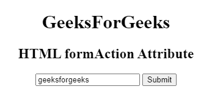

# HTML |表单属性

> 原文:[https://www.geeksforgeeks.org/html-formaction-attribute/](https://www.geeksforgeeks.org/html-formaction-attribute/)

**HTML 表单属性**用于*指定表单*的数据发送位置。提交表单后，formaction 属性被调用。表单数据将在表单提交后发送到服务器。它覆盖了 [<形态>](https://www.geeksforgeeks.org/html-form-tag/) 元素的动作属性特征。
**语法:**

```html
< element formaction="URL">
```

**适用:**

*   **<按钮>**
*   **<输入 type="image" >或<输入 type = "submit" >**

**属性值:**包含单值 URL，用于指定表单提交后要发送数据的文档的 URL。
该网址的可能值为:

*   **绝对 URL:** 它指向一个页面的完整地址。例如:*“数据结构”*
*   **相对 URL:** 用于指向网页内的文件。例如:*gfg.php*

**例:**

## 超文本标记语言

```html
<!DOCTYPE html>
<html>

<head>
    <title>
        HTML formAction Attribute
    </title>
</head>

<body style="text-align:center;">
    <h1>
        GeeksForGeeks
    </h1>

    <h2>
        HTML formAction Attribute
    </h2>

    <form action="#" method="get" target="_self">
        <input type="text"
               id="Geeks"
               name="myGeeks"
               value="geeksforgeeks"
               formTarget="_blank"
               formMethod="post"
               formAction="test.php">

        <input type="submit">
    </form>
</body>

</html>
```

**输出:**



**支持的浏览器:****表单属性**支持的浏览器如下:

*   谷歌 Chrome
*   微软公司出品的 web 浏览器
*   火狐浏览器
*   苹果 Safari
*   歌剧