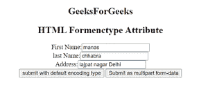

# HTML 模型属性

> 原文:[https://www.geeksforgeeks.org/html-formenctype-attribute/](https://www.geeksforgeeks.org/html-formenctype-attribute/)

**HTML 表单类型属性**用于<按钮>和<输入带有类型“图像”和“提交”的>标签。此属性用于指定当数据发送到服务器时，必须对表单数据进行编码。它覆盖了<表单>元素的 **enctype** 属性的特性。

基本上有三种类型来编码表单数据，如下所示-

*   **application/x-www-form-URL encoded:**为默认值。它在发送到服务器之前对所有字符进行编码。它将空格转换成+符号，将特殊字符转换成十六进制值。
*   **多部分/表单数据:**用于对文件上传控件进行编码。该值不编码任何字符。如果不使用这种编码类型，我们就无法上传图像和文件。
*   **文本/普通:**该值将空格转换为+符号，但不转换特殊字符。

**语法**

```html
<element formenctype="value">
```

**示例:**下面的代码演示了带有两个提交按钮的 formenctype 属性的使用。一个设置为默认编码类型，另一个设置为多部分表单数据。

## 超文本标记语言

```html
<!DOCTYPE html>
<html>

<head>
    <title>
        HTML Formenctype Attribute
    </title>
</head>

<body>
    <center>
        <h2>GeeksForGeeks</h2>

        <h2>HTML Formenctype Attribute</h2>

        <form action="#">
            <label>First Name:<input type="text"></label><br>
            <label>last Name:<input type="text"></label><br>
            <label>Address:<input type="text"></label><br>
            <input type="submit" 
                value="submit with default encoding type">
            <button type="submit" formenctype="multipart/form-data">
                Submit as multipart form-data
            </button>
        </form>
    </center>
</body>

</html>
```

**输出:**



**支持的浏览器:**

*   谷歌 Chrome
*   苹果 Safari
*   火狐浏览器
*   微软公司出品的 web 浏览器
*   歌剧