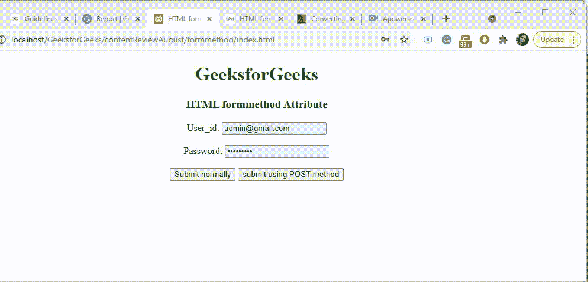
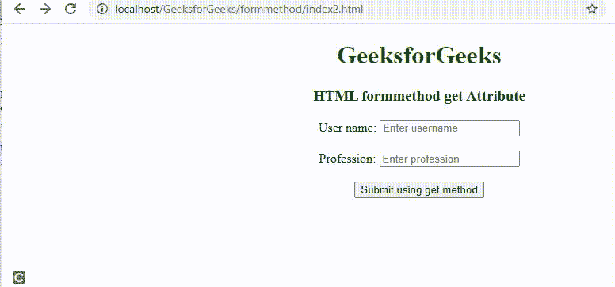

# HTML 表单方法属性

> 原文:[https://www.geeksforgeeks.org/html-formethod-attribute/](https://www.geeksforgeeks.org/html-formethod-attribute/)

HTML 表单方法属性用于定义在提交表单时用于发送表单数据的 HTTP 方法。GET 和 POST 是两种众所周知的 [HTTP 方法](https://www.geeksforgeeks.org/http-get-post-methods-php/)。此属性覆盖了*法的* **的 [**<属性，形成>**](https://www.geeksforgeeks.org/html-form-tag/) 元素。**

**支持的标签:**

*   [**<输入>**](https://www.geeksforgeeks.org/html-input-formmethod-attribute/)
*   [**<按钮>**](https://www.geeksforgeeks.org/html-button-formmethod-attribute/)

**语法:**

```html
<element formmethod="get|post">
```

**值:**

*   **get:** 在 get 方法中，表单提交后，表单值会在新浏览器选项卡的地址栏中可见。它的大小限制在 3000 个字符左右。它仅适用于非安全数据，不适用于敏感信息。
*   **post:** 在 post 方法中，表单提交后，表单值在新浏览器选项卡的地址栏中将不会像在 GET 方法中一样可见。它将表单数据追加到 HTTP 请求的正文中。它没有大小限制。此方法不支持结果的书签。

**示例 1:** 下面的代码演示了 *formmethod* 属性在 HTML [*<输入 type="submit" >*](https://www.geeksforgeeks.org/html-input-typesubmit/) 控件中的使用。为了更好地理解，请参考下面给出的输出。注意点击“正常提交”和“使用 POST 方法提交”时新网页的地址栏。两者是不同的，一个显示用户细节，而后者隐藏所有用户细节。

## 超文本标记语言

```html
<!DOCTYPE html>
<html>

<head>
    <title>
        HTML formmethod Attribute
    </title>
</head>

<body style="text-align:center;">

    <h1 style="color:green;">
        GeeksforGeeks
    </h1>

    <h3>HTML formmethod Attribute</h3>
    <form action="#"
        id="users"
        action="#"
        method="GET"
        target="_blank">

        User_id:
        <input type="email"
            name="email"
            placeholder="Enter Email Id">

        <br>
        <br> Password:
        <input type="password"
            name="pword"
            placeholder="Enter Password">
        <br>
        <br>

        <input type="submit" value="Submit normally">

      <input type="submit" formaction="#"
             value="submit using POST method"
             formmethod="post">

    </form>
</body>

</html>
```

**输出:**



**示例 2:** 以下示例使用 button 元素演示了 HTML i formmethod="get" 属性。它将用户条目提交到“GetDetail . PHP”PHP 文件中。当用户单击“使用 get 方法提交”时，这些值被提交到 PHP 文件中，请注意下面输出中的地址栏。

## 超文本标记语言

```html
<!DOCTYPE html>
<html>

<body style="text-align:center;">

    <h1 style="color:green;">
        GeeksforGeeks
    </h1>

    <h3>HTML formmethod get Attribute</h3>
    <form action="getDetail.php">

        User name:
        <input name="username"
            placeholder="Enter username">

        <br>
        <br> Profession:
        <input
            name="profession"
            placeholder="Enter profession">
        <br>
        <br>   

      <button formmethod="get">            
             Submit using get method
      </button>

    </form>
</body>

</html>
```

**输出:**



**支持的浏览器:**

*   谷歌 Chrome 9.0
*   Internet Explorer 10.0
*   Firefox 4.0
*   Safari 5.1
*   歌剧 10.6