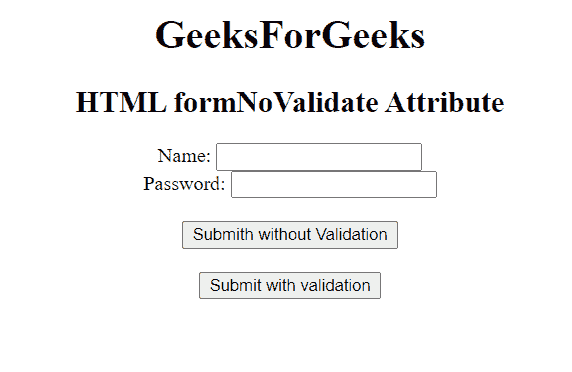

# HTML 表单模板属性

> 原文:[https://www . geeksforgeeks . org/html-formnovalidate-attribute/](https://www.geeksforgeeks.org/html-formnovalidate-attribute/)

第 **e HTML formnovalidate 属性**用于 **<输入>** 和 **<按钮>** 元素。此属性用于定义在将数据发送到服务器之前不得验证表单数据。它是一个布尔属性，覆盖了<表单>标签的**新数据**属性的特征。它是一个布尔属性，指示如果设置了它，则意味着在提交表单时不应该验证表单，否则必须验证表单。

**用途:**用于绕过旁路验证流程，让用户轻松保存表单填写进度，没有任何障碍。

**支持的标签:**

*   **<按钮>**
*   **<输入 type="submit" >和<输入 type="image" >**

**语法**

```html
<element formnovalidate>
```

**示例:**下面的代码用<按钮>元素说明了 formNoValidate 属性。

## 超文本标记语言

```html
<!DOCTYPE html>
<html>

<head>
    <title>
        HTML  formNoValidate Attribute
    </title>
</head>

<body style="text-align:center;">
    <h1>
        GeeksForGeeks
    </h1>

    <h2>
        HTML  formNoValidate Attribute
    </h2>

    <form action="#"
        method="get"
        target="_self">
        Name:
        <input type="text">
        <br> Password:
        <input type="password">
        <br>
        <br>
        <button type="submit"
                id="Geeks"
                name="myGeeks"
                value="Submit @ geeksforgeeks"
                formTarget="_blank"
                Formnovalidate>
            Submith without Validation
        </button>
        <br>
        <br>
        <button type="submit">
        Submit with validation
    </button>
    </form>

</body>

</html>
```

**输出**



**支持的浏览器:**

*   谷歌 Chrome
*   微软公司出品的 web 浏览器
*   歌剧
*   苹果野生动物园
*   火狐浏览器