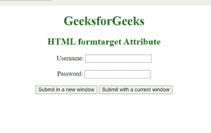

# HTML 表单目标属性

> 原文:[https://www.geeksforgeeks.org/html-formtarget-attribute/](https://www.geeksforgeeks.org/html-formtarget-attribute/)

**HTML 表单目标属性**用于指定名称或关键字，表示提交表单后在哪里显示结果。它指定提交的结果将在当前窗口、新选项卡或新框架中打开。该属性覆盖了<形态>元素的目标属性特征。

**用途:**用于<按钮>和<输入类型=“提交”>和<输入类型=“图像”>

**语法:**

```html
<element formtarget="_blank|_self|_parent|_top|framename">  
```

**属性值:**

*   **_blank:** 在新窗口打开链接。
*   **_self:** 在同一框架中打开链接的文档。
*   _ **父:**打开父框架集中的链接文档。
*   **_top:** 在窗口的整个正文中打开链接的文档。
*   **框架名称:**在命名框架中打开链接文档。

**示例:**此示例说明了一个包含两个提交按钮的表单，一个按钮将在当前框架中提交，另一个按钮将在新框架中提交。

## 超文本标记语言

```html
<!DOCTYPE html>
<html>

<head>
    <title>
        HTML formtarget Attribute
    </title>
</head>

<body>
    <center>
        <h1 style="color:green;">
            GeeksforGeeks
        </h1>

        <h2 style="color:green;">

            HTML formtarget Attribute
        </h2>

        <form action="#">
            Username:
            <input type="text" name="usrname">

            <br><br>

            Password:
            <input type="password" name="password">

            <br><br>

            <input type="submit" 
                value="Submit in a new window" 
                formtarget="_blank">

            <button type="submit" formtarget="_self">
                Submit with a current window
            </button>
        </form>
    </center>
</body>

</html>
```

**输出**



**支持的浏览器:**HTML formtarget 属性支持的浏览器列表如下–

*   谷歌 Chrome
*   微软公司出品的 web 浏览器
*   歌剧
*   火狐浏览器
*   苹果 Safari