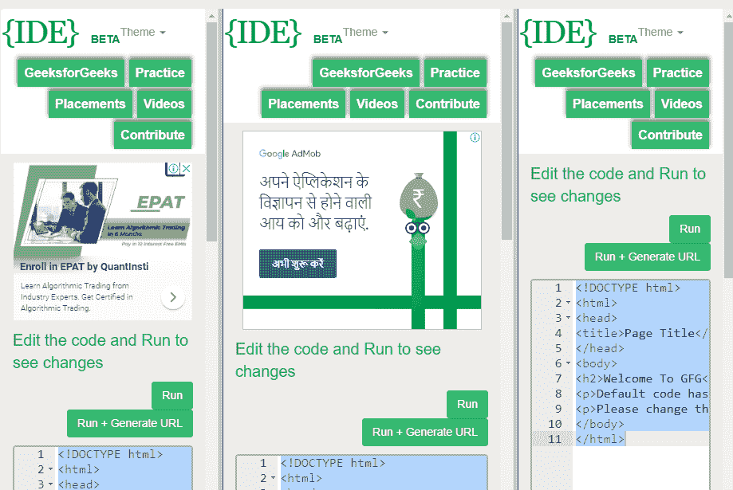

# HTML | longdesc 属性

> 原文:[https://www . geesforgeks . org/html-frame-long desc-attribute/](https://www.geeksforgeeks.org/html-frame-longdesc-attribute/)

**HTML <框架>长描述属性**用于指定包含框架内容长描述的页面。

**语法:**

```html
<frame longdesc="URL"> 
```

**属性值:**

*   **URL:** 它包含值，即指定包含框架内容的长描述的页面的 URL。
    1.  **绝对 URL:** 指向另一个网站。
    2.  **一个相对 URL:** 它指向网站内的一个文件。

**示例:**

## 超文本标记语言

```html
<!DOCTYPE html>
<html>

<head>
    <title>HTML frame longdesc Attribute</title>
</head>

<frameset cols="30%, 40%, 30%">
    <frame name="top"
           src="https://ide.geeksforgeeks.org/tryit.php"
           noresize="noresize"
           longdesc="gfg.txt" />

    <frame name="main"
           src="https://ide.geeksforgeeks.org/tryit.php"
           marginwidth="30" />

    <frame name="bottom"
           marginwidth="30"
           src="https://ide.geeksforgeeks.org/tryit.php"
           marginwidth="40" />
</frameset>

</html>
```

**输出:**



**注意:**html 5 不支持<框架>标签。