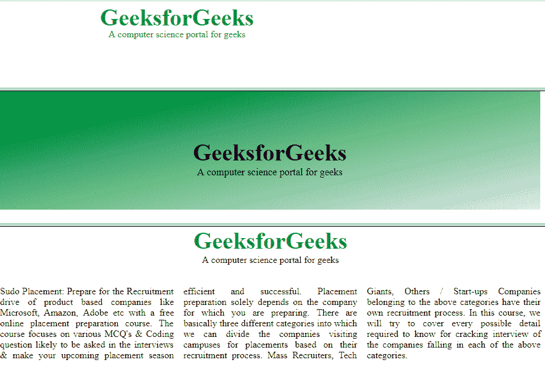

# HTML | frameset 行属性

> 原文:[https://www.geeksforgeeks.org/html-frameset-rows-attribute/](https://www.geeksforgeeks.org/html-frameset-rows-attribute/)

**HTML <框架集>行属性**用于*指定框架集*的大小和行数。每一帧的高度用逗号隔开。

**语法:**

```html
<frameset rows="pixels|%|*">
```

**属性值:**

*   **像素:**以像素为单位设置行高。例如:**“50px”**或**“50”**。
*   **%:** 行高按百分比设置。例**“70%”**。
*   ***:** 行高设置为所有可用空间。

**注意:**HTML 5 不支持<框架集>行属性。

**示例:**

```html
<!DOCTYPE html>
<html>

<head>
    <title>HTML frameset rows Attribute</title>
</head>

<!-- frameset attribute starts here -->
<frameset rows="20%, 60%, 20%">
    <frame name="top" src="attr1.png" />
    <frame name="main" src="gradient3.png" />
    <frame name="bottom" src="col_last.png" />
</frameset>
<!-- frameset attribute ends here -->

</html>
```

**输出:**


**支持的浏览器:**支持的浏览器 **HTML <框架集>行属性**如下:

*   谷歌 Chrome
*   微软公司出品的 web 浏览器
*   火狐浏览器
*   旅行队
*   歌剧