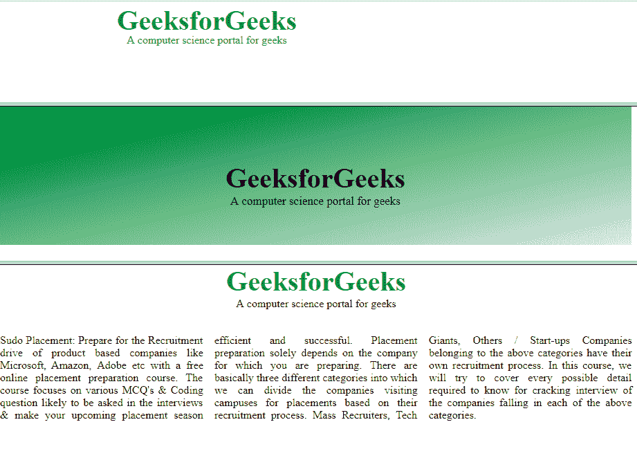

# HTML 框架集标签

> 原文:[https://www.geeksforgeeks.org/html-frameset-tag/](https://www.geeksforgeeks.org/html-frameset-tag/)

HTML 中的标签用于定义框架集。元素包含一个或多个框架元素。它用于指定框架集中的行数和列数以及它们的空间像素。每个元素可以保存一个单独的文档。

**注意:**html 5 不支持<框架集>标签。

**语法:**

```html
<frameset cols = "pixels|%|*">
```

**属性:**框架集属性列表如下:

*   [**cols**](https://www.geeksforgeeks.org/html-cols-attribute/)**:**cols 属性用于在网页浏览器中创建垂直框架。这个属性基本上用于定义框架集标签中的列数及其大小。
*   [**行**](https://www.geeksforgeeks.org/html-rows-attribute/) **:** 行属性用于在网页浏览器中创建水平框架。此属性用于定义框架集标记中的行数及其大小。
*   [**边框**](https://www.geeksforgeeks.org/html-border-attribute/)**:**frameset 标签的这个属性以像素为单位定义了每一帧边框的宽度。零值用于无边框。
*   [**【框架边框】**](https://www.geeksforgeeks.org/html-frame-frameborder-attribute/) **:** 框架集标签的该属性用于指定是否应该在框架之间显示三维边框。为此，使用两个值 0 和 1，其中 0 表示没有边框，值 1 表示有边框。
*   [**【框架间距】**](https://www.geeksforgeeks.org/html5-mathml-framespacing-attribute/) **:** 框架集标签的该属性用于指定框架集中框架之间的间距量。这可以采用任何整数值作为参数，该参数基本上表示像素值。

以下示例说明了 HTML 中的元素:
**示例 1:**

## 超文本标记语言

```html
<!DOCTYPE html>
<html>
    <head>
        <title>frameset attribute</title>
    </head>

    <!-- frameset attribute starts here -->   
    <frameset rows = "20%, 60%, 20%">
        <frame name = "top" src = "attr1.png" />
        <frame name = "main" src = "gradient3.png" />
        <frame name = "bottom" src = "col_last.png" />
        <noframes>
            <body>The browser you are working does not
                                  support frames.</body>
        </noframes>
    </frameset>
    <!-- frameset attribute ends here -->
</html>                               
```

**输出:**
上面的例子基本上是用 frameset 标签的 row 属性创建了三个水平框架:顶部、中间和底部，noframe 标签用于那个不支持 noframe 的浏览器。



**例 2:**

## 超文本标记语言

```html
<!DOCTYPE html>
<html>    
    <head>
        <title>frameset attribute</title>
    </head>

    <frameset cols = "30%, 40%, 30%">
        <frame name = "top" src = "attr1.png" />
        <frame name = "main" src = "gradient3.png" />
        <frame name = "bottom" src = "col_last.png" />        
        <noframes>
            <body>The browser you are working does
            not support frames.</body>
        </noframes>
    </frameset>
</html>
```

**输出:**
上面的例子基本上是用 frameset 标签的 col 属性来创建三个垂直框架:左、中、右。


**支持的浏览器:**

*   谷歌 Chrome
*   微软公司出品的 web 浏览器
*   火狐浏览器
*   歌剧
*   旅行队