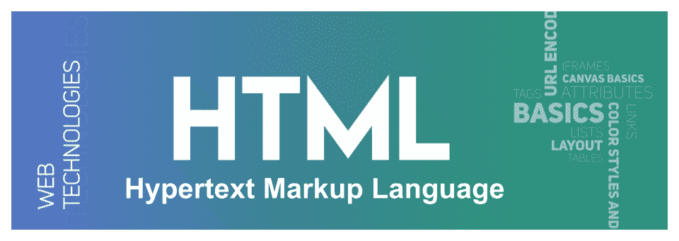
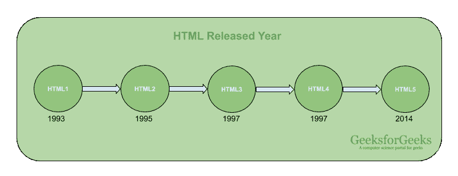

# HTML 全格式

> 原文:[https://www.geeksforgeeks.org/html-full-form/](https://www.geeksforgeeks.org/html-full-form/)



[**HTML**](https://www.geeksforgeeks.org/html-tutorials/) 代表**超文本标记语言**。这是一种标准标记语言，用于设计将在浏览器中显示为网页的文档。通过在其中使用 CSS(层叠样式表)和 JS (JavaScript)，这种语言可以变得更具交互性和吸引力。HTML 这个词定义了其中的一些特定含义。**超文本**来自超链接，表示几个页面之间的连接，**标记**表示定义的元素将是页面布局和页面内的元素。**语言**结合了这两个特性，使其成为超文本标记语言。

最初，HTML 是在 1993 年发布的，由*蒂姆·伯纳斯·李在 1990 年*开发。目前， **WHATWG** 社区正在开发 HTML。目前的 HTML5 版本获得如此大的人气是因为它增加了新的功能。所有网站的框架都是由超文本标记语言构成的，每个浏览器都在上面运行，这使得用户可以看到并方便使用。

**HTML 版本发布年份:**


**HTML 结构:**HTML 文档的结构如下:

```html
<!DOCTYPE html>
<html>
    <head>
        <title> <!-- title bar --> </title>
        <!-- header for the website -->
    </head>
    <body>

        <!-- body section of the website -->

    </body>
</html>                    
```

**HTML 的特点:**

*   **通俗易懂:**是你能说的最简单的语言，非常容易掌握这种语言，容易发展。
*   **灵活性:**这种语言非常灵活，你可以创建任何你想要的东西，一种灵活的方式来设计网页和文本。
*   **可链接:**你可以制作可链接的文本，就像用户可以通过这些特性从一个页面连接到另一个页面或网站一样。
*   **无限功能:**你可以添加任何你想要的视频、gif、图片或声音，这会让网站更有吸引力和可理解性。
*   **支持:**你可以使用这种语言在任何平台上显示文档，比如 Windows、Linux 或者 Mac。

**HTML 的优势:**

*   HTML 易于学习，易于应用，而且完全免费，你只需要一个文本编辑器和一个浏览器。
*   所有的浏览器都支持 HTML，它是最友好的搜索引擎。
*   HTML 可以轻松与其他语言集成，易于开发。
*   它是所有编程语言的基础，也是有史以来最轻的语言。
*   在超文本标记语言中，根据窗口大小或设备大小，显示经常变化，使用户阅读舒适。

**HTML 的缺点:**

*   HTML 只能用来创建静态网页，它不能创建动态网页。
*   超文本标记语言缺乏安全性。
*   创建一个简单的网页需要这么多标签。
*   HTML 语言不是集中的，也就是说，所有的网页都是连接在一起的，你必须单独设计它们，否则就需要使用 CSS。
*   当你试图创建一个巨大的网站时，HTML 变得复杂了。