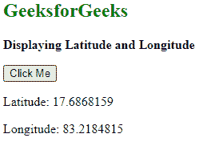
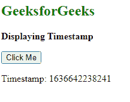
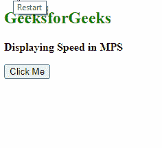
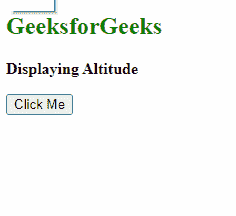
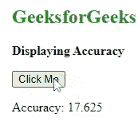

# HTML 地理定位观察位置()方法

> 原文:[https://www . geesforgeks . org/html-geolocation-watch position-method/](https://www.geeksforgeeks.org/html-geolocation-watchposition-method/)

在本文中，我们将讨论地理定位观察位置()方法。HTML 中的地理定位用于注册一个处理函数，每当设备的位置发生变化时，就会自动调用该函数。

**语法:**

```html
navigator.geolocation.watchPosition(showLoc, error, options);
```

**参数:**

*   **showLoc:** 也是一个成功消息功能，会显示纬度、经度、时间戳等
*   **错误:**如果适用，它将返回位置的错误信息和警告
*   **选项:**用于设置启用高精度、超时和最大图像

其中**显示锁定**成功消息包括以下内容:

*   **纬度:**该属性将返回给定位置的纬度
*   **经度:**该属性将返回给定位置的经度
*   **时间戳:**该属性将返回给定位置的时间戳
*   **速度:**该属性将返回给定位置的速度
*   **高度:**该属性将返回给定位置海平面以上的高度
*   **精度:**该属性将返回给定位置海平面以上的精度

**示例:**本示例禁用 watchPosition()方法的纬度和经度。

## 超文本标记语言

```html
<!DOCTYPE html>
<html>

<head>
    <meta charset="utf-8" />
    <meta name="viewport" 
          content="width=device-width,initial-scale=1" />
</head>

<body>
    <h2 style="color: green">GeeksforGeeks</h2>
    <p><b> Displaying Latitude and Longitude</b></p>
    <button onclick="getlocation()">Click Me</button>
    <p id="paraID"></p>

    <p id="paraID1"></p>

    <script>
        var variable1 = document.getElementById("paraID");
        var variable2 = document.getElementById("paraID1");

        // This function will get your current location
        function getlocation() {
            navigator.geolocation.watchPosition(showLoc);
        }

        // This function will show your current location
        function showLoc(pos) {
            variable1.innerHTML = "Latitude: " +
                pos.coords.latitude;

            variable2.innerHTML = "Longitude: " +
                pos.coords.longitude;
        }
    </script>
</body>

</html>
```

**输出:**



**示例 2:** 显示时间戳

## 超文本标记语言

```html
<!DOCTYPE html>
<html>

<head>
    <meta charset="utf-8" />
    <meta name="viewport" 
          content="width=device-width,initial-scale=1" />
</head>

<body>
    <h2 style="color: green">GeeksforGeeks</h2>
    <p><b> Displaying Timestamp</b></p>
    <button onclick="getlocation()">Click Me</button>
    <p id="paraID"></p>

    <script>
        var variable1 = document.getElementById("paraID");

        // This function will get your current location 
        function getlocation() {
            navigator.geolocation.watchPosition(showLoc);
        }

        // This function will show your current location
        function showLoc(pos) {
            variable1.innerHTML = "Timestamp: " +
                pos.timestamp;
        }
    </script>
</body>

</html>
```

**输出:**



**例 3:** 显示速度

## 超文本标记语言

```html
<!DOCTYPE html>
<html>

<head>
    <meta charset="utf-8" />
    <meta name="viewport" 
          content="width=device-width,initial-scale=1" />
</head>

<body>
    <h2 style="color: green">GeeksforGeeks</h2>
    <p><b> Displaying Timestamp</b></p>
    <button onclick="getlocation()">Click Me</button>
    <p id="paraID"></p>

    <script>
        var variable1 = document.getElementById("paraID");

        // This function will get your current location 
        function getlocation() {
            navigator.geolocation.watchPosition(showLoc);
        }

        // This function will show your current location
        function showLoc(pos) {
            variable1.innerHTML = "Timestamp: " +
                pos.timestamp;
        }
    </script>
</body>

</html>
```

**输出:**



**示例 4:** 显示高度

## 超文本标记语言

```html
<!DOCTYPE html>
<html>

<head>
    <meta charset="utf-8" />
    <meta name="viewport" 
          content="width=device-width,initial-scale=1" />
</head>

<body>
    <h2 style="color: green">GeeksforGeeks</h2>
    <p><b> Displaying Altitude</b></p>
    <button onclick="getlocation()">Click Me</button>
    <p id="paraID"></p>

    <script>
        var variable1 = document.getElementById("paraID");

        // This function will get your current location
        function getlocation() {
            navigator.geolocation.watchPosition(showLoc);
        }

        // This function will show your current location
        function showLoc(pos) {
            variable1.innerHTML = "Altitude: " +
                pos.coords.altitude;
        }
    </script>
</body>

</html>
```

**输出:**



**例 5:** 显示精度

## 超文本标记语言

```html
<!DOCTYPE html>
<html>

<body>
    <h2 style="color: green">GeeksforGeeks</h2>
    <p><b> Displaying Accuracy</b></p>
    <button onclick="getlocation()">Click Me</button>
    <p id="paraID"></p>

    <script>
        var variable1 = document.getElementById("paraID");

        // This function will get your current location
        function getlocation() {
            navigator.geolocation.watchPosition(showLoc);
        }

        // This function will show your current location
        function showLoc(pos) {
            variable1.innerHTML = "Accuracy: " +
                pos.coords.accuracy;
        }
    </script>
</body>

</html>
```

**输出:**

