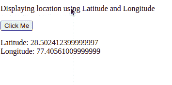
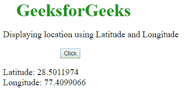
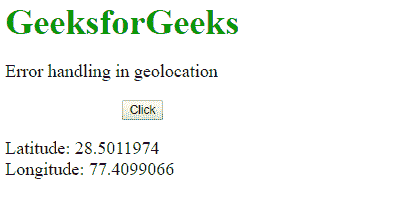
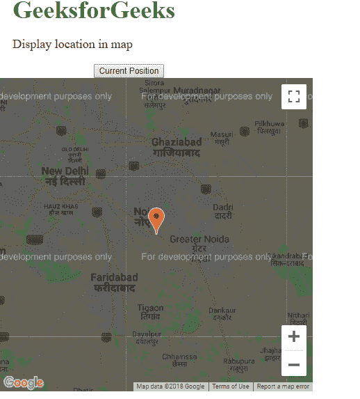

# HTML 地理位置

> 原文:[https://www.geeksforgeeks.org/html-geolocation/](https://www.geeksforgeeks.org/html-geolocation/)

**示例:**在本例中，我们通过 HTML Geolocation，借助经纬度简单显示当前位置。

## 超文本标记语言

```html
<!DOCTYPE html>
<html>

<body>

<p>Displaying location using Latitude and Longitude</p>

  <button class="geeks" onclick="getlocation()">
    Click Me
  </button>
  <p id="demo1"></p>

  <script>
    var variable1 = document.getElementById("demo1");
    function getlocation() {
      navigator.geolocation.getCurrentPosition(showLoc);
    }
    function showLoc(pos) {
      variable1.innerHTML =
        "Latitude: " +
        pos.coords.latitude +
        "<br>Longitude: " +
        pos.coords.longitude;
    }
  </script>
</body>

</html>
```

**输出:**



HTML5 中的地理位置用于与一些网站共享位置，并知道确切的位置。它主要用于本地企业、餐馆或在地图上显示位置。它使用 JavaScript 给后端服务器提供纬度和经度。大多数浏览器都支持地理定位应用编程接口。地理位置应用编程接口使用一个全局导航器对象，可以创建如下:
**语法:**

```html
var loc = navigator.geolocation
```

**位置属性:**下表确定了 getCurrentPosition()中使用的属性及其返回值。

*   **坐标纬度:**始终以十进制数返回纬度。
*   **坐标精度:**始终返回位置精度。
*   **坐标经度:**始终以十进制数返回经度。
*   **坐标高度:**返回海拔高度，单位为米(如果可用)。
*   **坐标高度精度:**返回位置的高度精度(如果可用)。
*   **坐标航向:**从北顺时针返回航向度数(如果可用)
*   **坐标速度:**以 mps 为单位返回速度(如果可用)。
*   **时间戳:**返回响应日期或时间(如果可用)

**地理定位方法:**地理定位有以下方法，使其有趣且更容易工作。

*   **getCurrentPosition():** 获取用户的当前位置。
*   **watchPosition():** 获取用户当前位置的定期更新。
*   **clearWatch():** 取消当前正在执行的 watchPosition 调用。

**示例:**

## 超文本标记语言

```html
var loc = navigator.geolocation;
function getLoc() {
loc.getCurrentPosition(showLoc, errHand);
}
```

上述函数也可以在不创建 navigator 对象的情况下编写，如下所示:

## 超文本标记语言

```html
function getlocation(){
navigator.geolocation.getCurrentPosition(showLoc, errHand);
}
```

**使用 HTML 地理定位显示位置:**下面的代码是通过 HTML 地理定位借助经纬度显示当前位置。

## 超文本标记语言

```html
<!DOCTYPE html>
<html>

<head>
  <title>Latitude and longitude</title>
  <style>
    .gfg {
      font-size: 40px;
      font-weight: bold;
      color: #009900;
      margin-left: 50px;
    }

    .geeks {
      margin-left: 150px;
    }

    p {
      font-size: 20px;
      margin-left: 20px;
    }
  </style>
</head>

<body>
  <div class="gfg">GeeksforGeeks</div>

<p>Displaying location using Latitude and Longitude</p>

  <button class="geeks" onclick="getlocation()">Click</button>
  <p id="demo1"></p>

  <script>
    var variable1 = document.getElementById("demo1");
    function getlocation() {
      navigator.geolocation.getCurrentPosition(showLoc);
    }
    function showLoc(pos) {
      variable1.innerHTML =
        "Latitude: " +
        pos.coords.latitude +
        "<br>Longitude: " +
        pos.coords.longitude;
    }
  </script>
</body>

</html>
```

**输出:**



**错误和拒绝处理:**处理地理定位中产生的错误并在出现错误时显示所需的消息非常重要。像 getCurrentPosition()这样的函数利用一个错误处理程序来处理生成的错误(函数 errHand 如上面的例子中所使用的)。错误处理程序使用的 PositionError 对象有两个属性，可以让函数有效地处理错误。

*   密码
*   消息

**地理定位中生成的错误:**

<figure class="table">T21】PERMISSION _ DENIEDT27】POSITION _ UNAVAILABLE

| mistake | Error description |
| --- | --- |
| 未知错误 | Unknown error |
| The application does not have permission to use the location service. |
|  |

</figure>

**示例:**

## 超文本标记语言

```html
<!DOCTYPE html>
<html>

<head>
  <title>Errors in geolocation</title>
  <style>
    .gfg {
      font-size: 40px;
      font-weight: bold;
      color: #009900;
      margin-left: 20px;
    }

    .geeks {
      margin-left: 150px;
    }

    p {
      font-size: 20px;
      margin-left: 20px;
    }
  </style>
</head>

<body>
  <div class="gfg">GeeksforGeeks</div>

<p>Error handling in geolocation</p>

  <button class="geeks" onclick="getlocation()">
    Click
  </button>
  <p id="demo1"></p>

  <script>
    var variable1 = document.getElementById("demo1");
    function getlocation() {
      navigator.geolocation.getCurrentPosition(showLoc, errHand);
    }
    function showLoc(pos) {
      variable1.innerHTML =
        "Latitude: " +
        pos.coords.latitude +
        "<br>Longitude: " +
        pos.coords.longitude;
    }

    function errHand(err) {
      switch (err.code) {
        case err.PERMISSION_DENIED:
          variable1.innerHTML =
            "The application doesn't have the" +
            "permission to make use of location services";
          break;
        case err.POSITION_UNAVAILABLE:
          variable1.innerHTML = "The location of the device is uncertain";
          break;
        case err.TIMEOUT:
          variable1.innerHTML = "The request to get user location timed out";
          break;
        case err.UNKNOWN_ERROR:
          variable1.innerHTML =
            "Time to fetch location information exceeded" +
            "the maximum timeout interval";
          break;
      }
    }
  </script>
</body>

</html>
```

**输出:**



**在地图中显示结果:**在地图中显示位置是一个非常有趣的任务。这些服务用于提供地图上的准确位置。

**示例:**

## 超文本标记语言

```html
<!DOCTYPE html>
<html>

<head>
  <title>Display location in map</title>
  <style>
    .gfg {
      font-size: 40px;
      font-weight: bold;
      color: #009900;
      margin-left: 20px;
    }

    .geeks {
      margin-left: 150px;
    }

    p {
      font-size: 20px;
      margin-left: 20px;
    }
  </style>
</head>

<body>
  <div class="gfg">GeeksforGeeks</div>

<p>Display location in map</p>

  <button class="geeks" type="button" onclick="getlocation();">
    Current Position
  </button>
  <div id="demo2"
       style="width: 500px; height: 500px"></div>
  <script src=
"https://maps.google.com/maps/api/js?sensor=false">
  </script>
  <script type="text/javascript">
    function getlocation() {
      if (navigator.geolocation) {
        navigator.geolocation.getCurrentPosition(showLoc, errHand);
      }
    }
    function showLoc(pos) {
      latt = pos.coords.latitude;
      long = pos.coords.longitude;
      var lattlong = new google.maps.LatLng(latt, long);
      var OPTions = {
        center: lattlong,
        zoom: 10,
        mapTypeControl: true,
        navigationControlOptions: {
          style: google.maps.NavigationControlStyle.SMALL,
        },
      };
      var mapg = new google.maps.Map(
        document.getElementById("demo2"),
        OPTions
      );
      var markerg = new google.maps.Marker({
        position: lattlong,
        map: mapg,
        title: "You are here!",
      });
    }

    function errHand(err) {
      switch (err.code) {
        case err.PERMISSION_DENIED:
          result.innerHTML =
            "The application doesn't have the permission" +
            "to make use of location services";
          break;
        case err.POSITION_UNAVAILABLE:
          result.innerHTML = "The location of the device is uncertain";
          break;
        case err.TIMEOUT:
          result.innerHTML = "The request to get user location timed out";
          break;
        case err.UNKNOWN_ERROR:
          result.innerHTML =
            "Time to fetch location information exceeded" +
            "the maximum timeout interval";
          break;
      }
    }
  </script>
</body>

</html>
```

**输出:**



**支持的浏览器:**

*   谷歌 Chrome
*   微软边缘
*   火狐浏览器
*   歌剧
*   旅行队