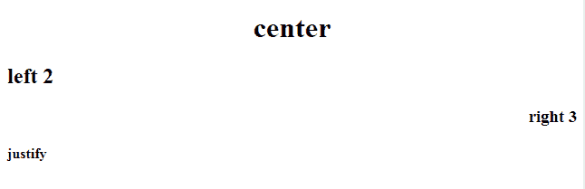

# HTML | h1 到

###### 对齐属性

> 原文: [https://www .吉斯弗格斯。org/html-h1-to-h6-align-attribute/](https://www.geeksforgeeks.org/html-h1-to-h6-align-attribute/)

**HTML < h1 >到< h6 >对齐属性**用于指定< h >元素或标题元素内部内容的对齐方式。

**语法:**

```html
<h1 align="left | right | center | justify">
```

**属性值:**

*   **左:**将内容设置为左对齐。
*   **右:**将内容设置为右对齐。
*   **中心:**我把 div 元素设置到中心。
*   **对齐:**将内容设置到对齐位置。

**示例:**

```html
<!DOCTYPE html>
<html>

<body>

    <h1 align="center">center</h1>
    <h2 align="left">left 2</h2>
    <h3 align="right">right 3</h3>
    <h4 align="justify">justify</h4>

</body>

</html>
```

**输出:**


**支持的浏览器:****HTML h1 align Attribute**支持的浏览器如下:

*   谷歌 Chrome
*   微软公司出品的 web 浏览器
*   火狐浏览器
*   苹果 Safari
*   歌剧