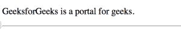

# HTML 标签

> 原文:[https://www.geeksforgeeks.org/html-head-tag/](https://www.geeksforgeeks.org/html-head-tag/)

HTML 中的标签用于定义包含与文档相关信息的文档头部。
头<标签包含其他头元素，如<标题>、<元>、<链接>、<样式>、<链接>等。
在 HTML 4.01 中<头>元素是强制的，但是在 HTML5 中<头>元素可以省略。
**标签特定属性** :
下面提到的< hr >标签的布局属性已经从 HTML5 中移除。

**属性:**

*   **配置文件:**用于指定包含一个或多个元数据配置文件的文档的 URL，以便浏览器清楚地了解信息。

**语法:**

```html
<head>
<title>Title of the document</title>
</head>
```

下面的程序说明了元素:

**程序 1:**

## 超文本标记语言

```html
<!DOCTYPE html>
<html lang="en">

<head>
    <title>HTML Head Tag </title>
</head>

<body>

<p>GeeksforGeeks is a portal for geeks.</p>

    <hr>
</body>

</html>
```

**输出:**



**程序 2(使用头部标签内的样式标签)**

## 超文本标记语言

```html
<!DOCTYPE html>

<html>

<head>
    <style>
        body {
            background: skyblue;
        }

        h1 {
            color: red;
        }

        p {
            color: blue;
        }
    </style>
</head>

<body>

    <h1>GeeksforGeeks</h1>

<p>It is a portal for geeks.</p>

</body>

</html>
```

**输出:**


**程序 3(使用头标内的链接标签):**

## 超文本标记语言

```html
<!DOCTYPE html>

<html>

<head>
    <link rel="stylesheet" type="text/css" href="mystyle.css">
</head>

<body>

    <h1>GeeksforGeeks</h1>

<p>It is a portal for geeks.</p>

</body>

</html>
```

**输出:**


**支持的浏览器:**

*   谷歌 Chrome
*   微软公司出品的 web 浏览器
*   火狐浏览器
*   歌剧
*   旅行队